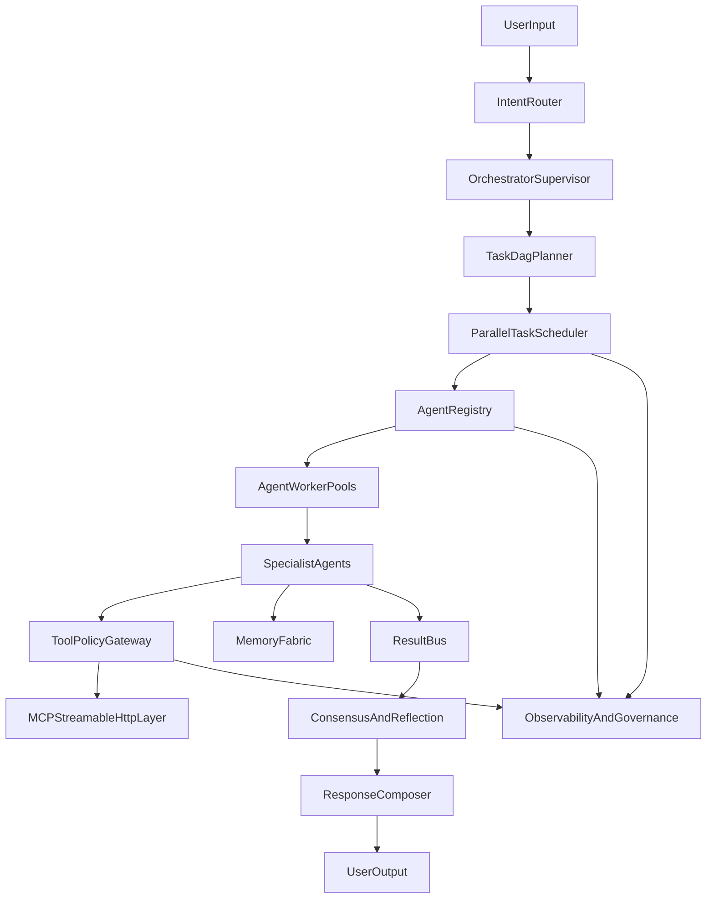

# OmniAnalyst V5 Unified Specification Plan

## Goal
Produce a complete, corrected, and expanded `v5` architecture document that includes `v4` baseline concepts plus a substantial `v5` upgrade layer, delivered as a new file: [C:/Users/dhanu/Downloads/omniagent/v5.md](C:/Users/dhanu/Downloads/omniagent/v5.md).

## Source Baseline
- Use [C:/Users/dhanu/Downloads/omniagent/v4.md](C:/Users/dhanu/Downloads/omniagent/v4.md) as the authoritative base.
- Preserve existing strengths already present in `v4` (skills system, MCP streamable HTTP, task engine, hooks, plugin lifecycle, memory model, WSIL).
- Upgrade where `v4` is descriptive but not fully operationally specified (parallel swarm control, management APIs, governance contracts, runtime SLAs).

## Planned V5 Additions (Integrated, Not Superficial)
- **Version framing + navigation**
  - Add explicit `v5` version banner, change log, and expanded TOC entries.
  - Include a "v4 -> v5 delta" section so readers can immediately see what is new.

- **Claude Code-like operational parity**
  - Formalize planning loop semantics (plan/no-op pattern, execution checkpoints, self-critique loop, bounded retries).
  - Add strict tool invocation policy: preconditions, deterministic argument shaping, post-tool validation, fallback hierarchy.
  - Add session continuity model (AGENTS.md + episodic + procedural updates) with explicit write/read timing.

- **Parallel multi-agent runtime (production-grade)**
  - Add worker-pool model (agent-type pools, concurrency budgets, queue isolation, starvation prevention).
  - Add fan-out/fan-in orchestration patterns tied to dependency DAG and critical-path optimization.
  - Add scheduler policies: token/cost-aware dispatch, latency-aware routing, speculative execution and cancellation rules.
  - Add failure model: partial-failure containment, circuit breakers, retry scopes, quorum-based completion.

- **Agent management plane**
  - Define `AgentRegistry` and lifecycle states: `DISCOVERED -> REGISTERED -> READY -> BUSY -> DEGRADED -> DRAINING -> OFFLINE`.
  - Specify management APIs/contracts for registration, health, heartbeats, capacity, assignment, pause/resume, and retirement.
  - Add identity/permission boundaries for agent classes and plugin-provided subagents.
  - Add policy for human escalation, override, and kill-switch workflows.

- **Safety, governance, and provenance hardening**
  - Add policy graph for tool-risk classes and mandatory approval boundaries.
  - Add response provenance contract (which agent/tool/source produced each claim).
  - Add compliance-focused audit schema (immutable event envelope + correlation IDs across tasks/agents/tools).

- **Operator UX + observability**
  - Add swarm operations panel requirements: live topology, queue depth, agent health, failed-task hotspots.
  - Define SLIs/SLOs: task success rate, p95 latency per agent class, tool failure rate, budget burn rate.
  - Add runbook hooks for incident triage and replay/time-travel assisted debugging.

## Core V5 Architecture Diagram (to include in doc)

## Document Quality and Correctness Pass
- Resolve naming consistency (`Research Agent` vs `Web Search Agent` role boundaries, scheduler terminology, middleware/event names).
- Normalize schemas and state names across sections (task states, agent states, hook tiers, policy IDs).
- Ensure each new V5 subsystem includes:
  - purpose,
  - architecture,
  - schema/contract,
  - runtime flow,
  - failure handling,
  - observability.

## Deliverable
- Final artifact: [C:/Users/dhanu/Downloads/omniagent/v5.md](C:/Users/dhanu/Downloads/omniagent/v5.md)
- Content style: complete architecture specification (v4 baseline + v5 expansion), implementation-oriented and internally consistent.