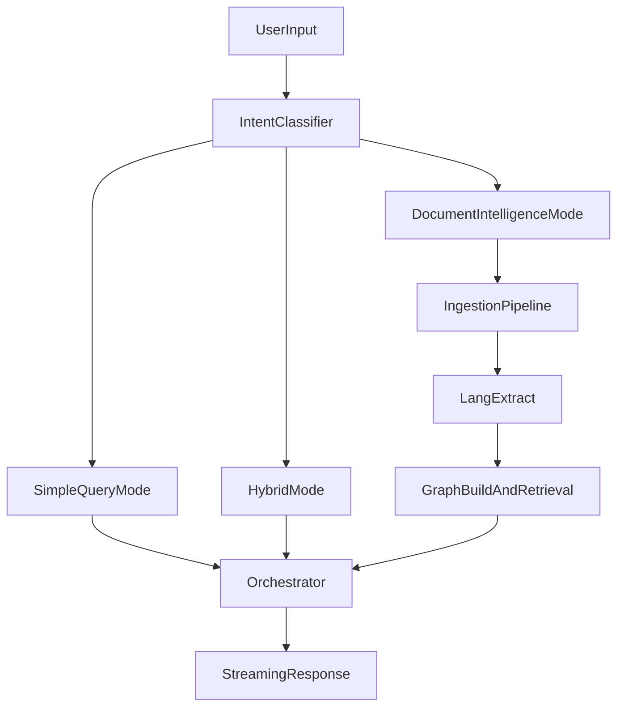
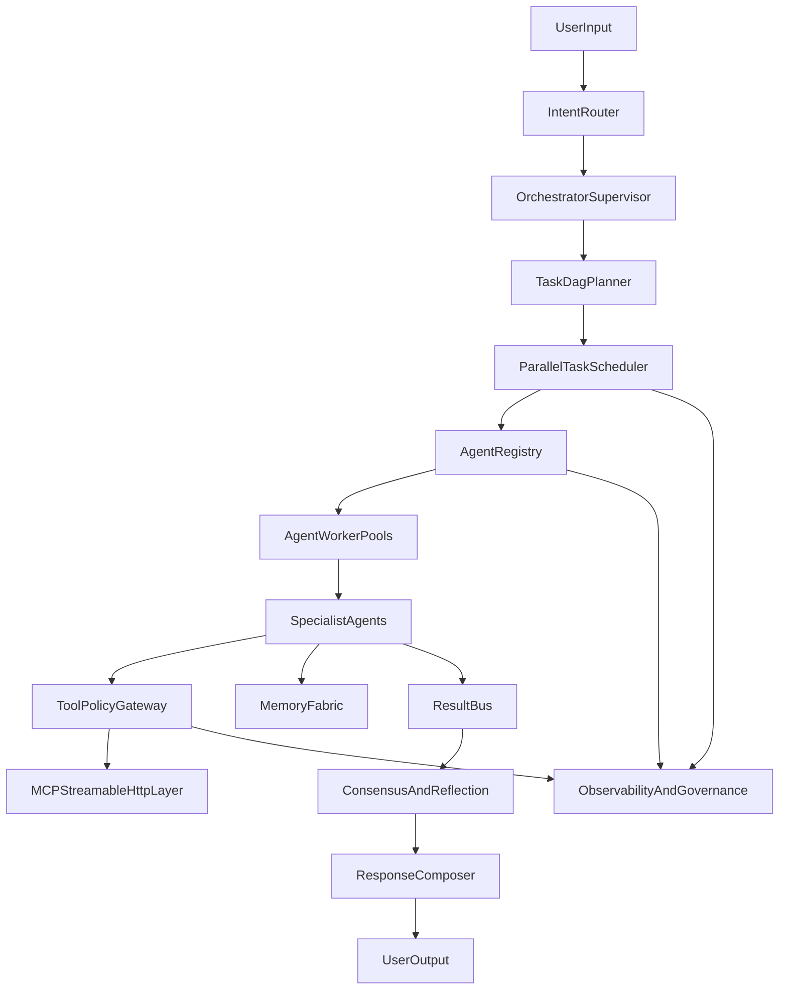
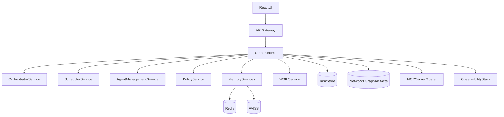

# WAJAgent

Combined specification from v4.md and v5.md.

---

## v4.md

# 🧠 OmniAnalyst — Complete Architecture Specification
### Production-Grade Multi-Agent AI Platform
### GraphRAG · LangExtract · Anti-Chunking · OCR · MCP Streamable HTTP · DeepAgent Skills · Web Search Intelligence · 5-Tier Hook System · Formal Task Engine · Plugin System

---

## Table of Contents

1. [Platform Overview](#1-platform-overview)
2. [Operating Modes](#2-operating-modes)
3. [Architecture Origins](#3-architecture-origins)
4. [MCP Streamable HTTP Layer](#4-mcp-streamable-http-layer)
5. [Skills System (DeepAgent-Style)](#5-skills-system-deepagent-style)
6. [Ingestion Pipeline (Anti-Chunking Engine)](#6-ingestion-pipeline-anti-chunking-engine)
7. [LangExtract Layer](#7-langextract-layer)
8. [Knowledge Graph Layer (GraphRAG)](#8-knowledge-graph-layer-graphrag)
9. [Multi-Agent Swarm](#9-multi-agent-swarm)
10. [5-Layer Memory System](#10-5-layer-memory-system)
11. [Time Travel Engine](#11-time-travel-engine)
12. [Streaming Architecture](#12-streaming-architecture)
13. [Web Search Intelligence Layer (WSIL)](#13-web-search-intelligence-layer-wsil)
14. [5-Tier Hook System](#14-5-tier-hook-system)
15. [Formal Task Engine](#15-formal-task-engine)
16. [Plugin System](#16-plugin-system)
17. [Complete 20-Layer Middleware Stack](#17-complete-20-layer-middleware-stack)
18. [Combined End-to-End Workflow](#18-combined-end-to-end-workflow)
19. [Original Toppings (Unique Features)](#19-original-toppings-unique-features)
20. [Complete Project Folder Structure](#20-complete-project-folder-structure)
21. [Tech Stack Summary](#21-tech-stack-summary)
22. [Design Principles](#22-design-principles)

---

## 1. Platform Overview

OmniAnalyst is a **production-grade, multi-agent AI platform** built for intelligent document analysis and query resolution. It integrates a 20-layer middleware stack, a 5-tier hook system, a formal async task engine with dependency DAGs, a distributable plugin system, a dedicated Web Search Intelligence Layer, a DeepAgent-style Skills system, MCP Streamable HTTP tool integration, and a 5-layer memory system — all wired into a single, fully observable agent graph.

Every capability — MCP servers, skill loading, memory, tools, hooks, tasks, and plugins — operates **inside** OmniAnalyst's agent graph. Nothing is bolted on externally.

---

## 2. Operating Modes

| Mode | Trigger | Example |
|------|---------|---------|
| **Simple Query Mode** | User types a plain question, no file uploaded | *"What are the top revenue metrics for SaaS?"* |
| **Document Intelligence Mode** | User uploads a file (any format) | Upload a scanned PDF, Excel sheet, image, DOCX |

### Entry Point Routing

```
                        ┌──────────────────────────┐
                        │       USER INTERFACE      │
                        └────────────┬─────────────┘
                                     │
              ┌──────────────────────▼──────────────────────┐
              │           QUERY INTENT CLASSIFIER           │
              │  (LLM-powered — runs before anything else)  │
              └────────────────┬───────────────────────────┘
                               │
              ┌────────────────▼───────────────────┐
              │                                    │
     ┌────────▼─────────┐              ┌──────────▼──────────┐
     │  SIMPLE QUERY    │              │  DOCUMENT + QUERY   │
     │  MODE            │              │  MODE               │
     │                  │              │                     │
     │  Direct agent    │              │  Full Ingestion     │
     │  reasoning path  │              │  → GraphRAG         │
     │  (no file)       │              │  → LangExtract      │
     │                  │              │  → Agent Swarm      │
     └──────────────────┘              └─────────────────────┘
```

### Simple Query Mode Flow

```
User: "Summarize the latest GDPR obligations for SaaS companies"
        │
        ▼
Query Intent Classifier → SIMPLE_QUERY
        │
        ▼
SkillsMiddleware → loads skills/gdpr.md + skills/legal-summary.md
        │
        ▼
AGENTS.md MemoryMiddleware → injects session memory into system prompt
        │
        ▼
TodoListMiddleware → task decomposition (no-op plan tool call)
        │
        ▼
LLMToolSelectorMiddleware → picks: [mcp:web_search, mcp:memory_retrieval]
        │
        ▼
MCP Streamable HTTP Client → calls registered web_search MCP server
        │
        ▼
WSIL Pipeline → query rewriting, freshness scoring, Citation Object creation
        │
        ▼
Orchestrator → routes to: Summary Agent + Audit Agent (parallel)
        │
        ▼
Episodic Memory → "user previously asked about GDPR in session 47"
        │
        ▼
Streamed response + agent activity feed → user
```

### Document Intelligence Mode Flow

```
User uploads: scanned_invoice.pdf + "Extract all line items and totals"
        │
        ▼
Query Intent Classifier → DOCUMENT_QUERY
        │
        ▼
SkillsMiddleware → loads skills/invoice-extraction.md + skills/ocr-pipeline.md
        │
        ▼
Ingestion Pipeline (OCR → Parse → Clean → Anti-Chunking Layer)
        │
        ▼
LangExtract → Structured Entity Extraction with grounding
        │
        ▼
NetworkX entity graph construction with LangExtract-grounded relations
        │
        ▼
Hybrid Retrieval: Vector + Graph + BM25 + Metadata + Reranker
        │
        ▼
Orchestrator routes to Specialist Agent Swarm
        │
        ▼
Streamed, grounded, structured response + explainability panel → user
```

---

## 3. Architecture Origins

### From Claude Code / DeepAgents Architecture

- **No-op planning tool** — the agent calls `plan()` to structure its reasoning, but the tool does nothing. This is a context engineering hack: forcing the model to articulate steps improves execution quality dramatically.
- **AGENTS.md memory injection** — at session start, a long-term context file is loaded from the filesystem backend into the system prompt. No LLM call needed; it is injected directly.
- **SKILL.md dynamic loading** — skills are markdown files in known directories. At session start, `SkillsMiddleware` reads them and injects them as instructions. The agent discovers relevant skills itself by reading the skill index.
- **Filesystem as context store** — instead of ballooning the context window with intermediate reasoning, agents write to a virtual filesystem (in-memory, local, or persistent). Long outputs are files, not prompt text.
- **Sub-agent spawning** — the Orchestrator can spawn specialist agents as sub-processes that share state via LangGraph's BaseStore. They are first-class graph nodes, not just function calls.
- **Tiny tool surface** — you do not need 200 specialized tools. You need bash, a filesystem, a planner, and good skills. The MCP layer brings in external tools only when needed.

### From MCP Streamable HTTP (MCP Spec 2025-03-26)

- SSE transport is deprecated as of MCP spec 2025-03-26. OmniAnalyst implements **Streamable HTTP** as its sole transport for all external MCP tool servers.
- Every external capability is exposed as a Streamable HTTP MCP server consumed via `MultiServerMCPClient`.
- MCP interceptors bridge the gap between stateless MCP servers and OmniAnalyst's stateful LangGraph runtime — injecting user context, state slices, and credentials at tool call time without passing them through the LLM.

---

## 4. MCP Streamable HTTP Layer

### Why Streamable HTTP (Not SSE, Not Stdio)

SSE transport is deprecated per MCP specification 2025-03-26. Stdio is only suitable for local subprocess tools. OmniAnalyst uses **Streamable HTTP** exclusively because:

- Single persistent HTTP connection handles both request and streaming response in one round trip
- Works across network boundaries (remote MCP servers, cloud-hosted tools)
- Supports custom auth headers (`Authorization: Bearer`) injected per-call by MCP Interceptors
- Multiple MCP servers aggregated into a single flat tool list by `MultiServerMCPClient`
- The agent cannot see server boundaries — it picks tools by name and description, same as any native tool

### MCP Server Registry

```
omni-analyst/
└── mcp/
    ├── registry.py              # Central server registry — all MCP server configs
    ├── interceptors/
    │   ├── auth_injector.py     # Injects user credentials per tool call
    │   ├── state_bridge.py      # Bridges LangGraph state → MCP tool context
    │   ├── rate_limiter.py      # Per-server rate limiting interceptor
    │   └── audit_logger.py      # Logs every MCP tool call to episodic memory
    └── servers/
        ├── web_search_server/   # FastMCP: Tavily (primary) / SerpAPI (secondary)
        ├── database_server/     # FastMCP: DuckDB / PostgreSQL NL-to-SQL
        ├── calendar_server/     # FastMCP: Google Calendar / Outlook
        ├── email_server/        # FastMCP: Gmail / Outlook read + send
        ├── github_server/       # FastMCP: repo search, PR creation
        ├── networkx_graph_server/        # FastMCP: graph query interface
        ├── redis_server/        # FastMCP: semantic cache R/W
        └── internal_api_server/ # FastMCP: user-defined internal API connector
```

### MCP Client Initialization (Inside Agent Graph)

```
At graph boot (before_agent hook):
    MultiServerMCPClient reads registry.py
        │
        ▼
    For each server entry → transport: "streamable_http", url: SERVER_URL
        │
        ▼
    client.get_tools() → flat list of LangChain-compatible tool objects
        │
        ▼
    Tools injected into Orchestrator + each Specialist Agent's tool registry
        │
        ▼
    MCP Interceptors attached per server:
        ├── AuthInjectorInterceptor   → reads user credentials from LangGraph Store
        ├── StateBridgeInterceptor    → passes doc_id, session_id, user_id to tool
        ├── RateLimiterInterceptor    → enforces per-server call budget
        └── AuditLoggerInterceptor   → writes tool call event to episodic memory
```

### MCP Transport Flow (Streamable HTTP)

```
Agent calls tool: mcp:web_search(query="GDPR SaaS 2025")
        │
        ▼
wrap_tool_call hook fires (ToolCallLimitMiddleware + ToolRetryMiddleware)
        │
        ▼
MCP Interceptor chain executes:
    AuthInjectorInterceptor → adds Authorization header
    StateBridgeInterceptor  → injects {session_id, user_id, doc_context}
    RateLimiterInterceptor  → checks budget; passes or blocks
        │
        ▼
streamablehttp_client opens HTTP stream to web_search MCP server
        │
        ▼
Tool result streams back as chunked HTTP response
        │
        ▼
AuditLoggerInterceptor → writes {tool, args, result_summary, ts} to episodic memory
        │
        ▼
Tool result returned to agent as ToolMessage in LangGraph state
```

---

## 5. Skills System (DeepAgent-Style)

### What Skills Are

Skills are **markdown files** (`SKILL.md`) in known directories that an agent discovers and loads **dynamically** at session start. A skill is not a tool. A skill is **instruction + context** that changes how the agent reasons and acts when facing a specific type of task. The agent reads the relevant SKILL.md, then uses its existing tools differently.

### Skill File Structure

```
omni-analyst/skills/
│
├── public/                        # Always loaded for all sessions
│   ├── AGENTS.md                  # Master session memory / persona file
│   ├── core-reasoning/
│   │   └── SKILL.md               # How to decompose and plan complex queries
│   ├── output-formatting/
│   │   └── SKILL.md               # How to format tables, citations, confidence marks
│   └── tool-usage/
│       └── SKILL.md               # Which MCP tools to use for which task types
│
├── domain/                        # Loaded based on query domain classification
│   ├── finance/
│   │   ├── SKILL.md               # Financial document extraction patterns
│   │   └── schemas/
│   │       ├── invoice_schema.json
│   │       └── balance_sheet_schema.json
│   ├── legal/
│   │   ├── SKILL.md               # Contract analysis, clause extraction, risk flags
│   │   └── clause_taxonomy.md
│   ├── medical/
│   │   ├── SKILL.md               # Medical report parsing, ICD codes, PII rules
│   │   └── redaction_rules.md
│   ├── research/
│   │   ├── SKILL.md               # Literature search, citation extraction, synthesis
│   │   └── citation_formats.md
│   └── engineering/
│       ├── SKILL.md               # Code review, architecture diagram extraction
│       └── code_smell_patterns.md
│
├── ingestion/                     # Loaded by Ingestion Agent at file upload
│   ├── ocr-pipeline/
│   │   └── SKILL.md               # OCR engine selection, preprocessing, confidence scoring
│   ├── table-extraction/
│   │   └── SKILL.md               # Table structure recovery from PDF/image
│   ├── invoice-extraction/
│   │   └── SKILL.md               # Invoice-specific field extraction patterns
│   └── scanned-pdf/
│       └── SKILL.md               # Handling rotated, noisy, multi-column scanned PDFs
│
├── agents/                        # Per-agent skill overrides
│   ├── stats-agent/
│   │   └── SKILL.md               # Statistical methods, anomaly detection patterns
│   ├── sql-agent/
│   │   └── SKILL.md               # NL-to-SQL patterns, schema inference
│   ├── visual-agent/
│   │   └── SKILL.md               # Chart type selection, axis labeling, color schemes
│   ├── audit-agent/
│   │   └── SKILL.md               # PII detection rules, compliance checklist patterns
│   ├── compare-agent/
│   │   └── SKILL.md               # Diff strategies, semantic vs lexical comparison
│   ├── web-search-agent/
│   │   └── SKILL.md               # Web search strategy, citation handling, freshness scoring
│   └── reflection-agent/
│       └── SKILL.md               # Devil's Advocate reasoning patterns
│
└── user/                          # User-uploaded or session-generated skills
    └── (auto-generated from procedural memory and user uploads)
```

### SKILL.md File Format (Standard)

```markdown
---
name: invoice-extraction
description: "Use this skill when the user uploads an invoice, receipt, or billing document."
triggers: [invoice, bill, receipt, line_items, totals, vendor]
priority: domain          # public | domain | agent | user
version: 1.2
---

# Invoice Extraction Skill

## When to Use This Skill
## Extraction Strategy
## Schema to Follow
## Common Edge Cases
## Output Format
```

### SkillsMiddleware Hook Behavior

```
Hook: before_agent
    1. Read skill index from filesystem backend
    2. Run query through skill trigger matcher
    3. Select top-N skills: public/* always + matched domain/* + agent-specific/*
    4. Read each SKILL.md file from backend
    5. Inject skill content into system prompt
    6. Store loaded skill list in agent state: state["loaded_skills"]

Hook: wrap_model_call
    - Check if new tool results suggest a skill switch
    - Append new skill content if needed (lazy skill loading)

Hook: after_agent
    - If agent produced high-quality output for a new doc type, offer to write
      a new SKILL.md to user/ directory for future sessions
```

### AGENTS.md — The Master Memory File

`AGENTS.md` is a special markdown file loaded **once per session** by `MemoryMiddleware.before_agent()` and injected into the system prompt. It contains:

```markdown
# OmniAnalyst Agent Context

## Platform Identity
You are OmniAnalyst — an intelligent document and query analysis platform.

## Behavioral Rules
- Always cite the source chunk when making a factual claim
- Never hallucinate entity values — all extracted data must be grounded
- When confidence is below 0.7, say so explicitly
- Use the plan() tool before any multi-step task

## User Preferences (updated from procedural memory)
- Output format: structured with tables and section headers
- Currency: always display in USD with INR conversion
- Response language: English

## Known Document Corpus
- Q3_Financials.pdf (uploaded 2025-11-01) — NetworkX graph ID: doc_abc123

## Active MCP Servers
- web_search (Tavily) — available
- database (DuckDB) — available
- networkx_graph — available

## Last Session Summary
User analyzed invoice batch from Nov 2025. Flagged 3 duplicate line items.
```

This file is **auto-updated** at session end by `MemoryMiddleware.after_agent()`.

---

## 6. Ingestion Pipeline (Anti-Chunking Engine)

```
┌─────────────────────────────────────────────────────────────────────┐
│                    INTELLIGENT INGESTION PIPELINE                   │
│                                                                     │
│  Stage 1: FILE TYPE DETECTION + ROUTING                             │
│   .pdf (digital)  → PDFPlumber / PyMuPDF                            │
│   .pdf (scanned)  → OCR Engine (3-tier)                             │
│   .xlsx / .csv    → Pandas → schema profiling                       │
│   .docx           → python-docx → section/table extraction          │
│   .png / .jpg     → Vision OCR (multimodal LLM + Tesseract)         │
│   .txt / .md      → Direct injection                                │
│   .pptx           → python-pptx → slide text + speaker notes        │
│                                                                     │
│  Stage 2: OCR LAYER (3-Tier)                                        │
│   Tier 1: Tesseract (fast baseline)                                 │
│   Tier 2: Surya OCR (layout-aware, tables, rotated text)            │
│   Tier 3: Vision LLM via MCP (GPT-4o / Claude Vision)              │
│   • Page-level confidence → auto-fallback between tiers             │
│   • Deskew + denoise via OpenCV before OCR                          │
│   • Output: Unicode text + bounding box metadata per element        │
│                                                                     │
│  Stage 3: STRUCTURAL PRESERVATION                                   │
│   • Document hierarchy: H1 → H2 → H3 → paragraph                   │
│   • Tables → structured JSON (not flattened)                        │
│   • Figures → Vision LLM description + alt-text                     │
│   • Each element tagged: {type, page, section, bbox, source_uri}   │
│                                                                     │
│  Stage 4: ANTI-CHUNKING LAYER                                       │
│   ChunkingStrategyAgent selects strategy:                           │
│   ┌─ Semantic Chunking (default prose)                              │
│   │   Embedding similarity grouping — no mid-idea cuts              │
│   ├─ Structural/Hierarchical (reports, manuals)                     │
│   │   Chunks follow H1/H2/H3 — never crosses sections              │
│   ├─ Parent-Document Retrieval (dense technical PDFs)               │
│   │   Large parent → small child chunks retrieved → parent context │
│   ├─ Late Chunking (long-context models)                            │
│   │   Embed THEN chunk — preserves cross-sentence meaning           │
│   └─ Token-Based (cost mode / tight context windows)                │
│   ChunkingQualityMiddleware validates each chunk;                   │
│   Low-coherence chunks → re-chunked via fallback ladder             │
│                                                                     │
│  Stage 5: PII SCAN                                                  │
│   PIIMiddleware fires before any chunk reaches an agent             │
│   Redacts: SSN, email, phone, credit card, medical ID, passport    │
│   Replaced with: [REDACTED_TYPE]                                    │
└─────────────────────────────────────────────────────────────────────┘
```

---

## 7. LangExtract Layer

After ingestion, **LangExtract** runs over cleaned text to extract semantically grounded, schema-consistent structured data.

```python
ExtractionSchema = {
    "vendor": {"type": "string", "grounded": True},
    "invoice_date": {"type": "date", "grounded": True},
    "line_items": [{
        "description": "string",
        "quantity": "number",
        "unit_price": "number",
        "total": "number"
    }],
    "total_amount": {"type": "currency", "grounded": True},
    "payment_terms": {"type": "string", "grounded": True}
}
# Output: structured JSON + character offset of every field in source
# Visual HTML report showing highlights in original document
```

---

## 8. Knowledge Graph Layer (GraphRAG)

```
Clean Text (from LangExtract)
        │
        ▼
LangExtract-grounded graph extractor
  ├── Entity Extraction: Person, Org, Product, Date, Amount, Location
  ├── Relationship: OWNS, REPORTS_TO, MENTIONS, CONTAINS, SIGNED_BY
  └── Confidence scoring per extracted triple
        │
        ▼
NetworkX graph runtime with persisted graph artifacts
  ├── Nodes: entities + source_uri + page_number + chunk_id
  ├── Edges: typed relationships + confidence scores
  └── Full-text index for fuzzy entity search

Lazy Graph Building:
  └── Shallow graph (entity co-occurrence) → built instantly on upload
  └── Deep graph (full LangExtract-grounded graph extractor) → built on-demand
      triggered by: GraphContextInjector detecting relational query
```

### Hybrid Retrieval

```
① FAISS Vector Search      → top-k semantic chunks
② ColBERT Late Interaction  → token-level relevance over FAISS candidates
③ NetworkX Graph Traversal  → multi-hop entity relationships
④ Metadata Filter Retrieval → typed metadata filters before vector search
⑤ BM25 Keyword Search       → exact match fused via RRF
⑥ Parent-Doc Expansion      → fetch full context from parent chunks
```

---

## 9. Multi-Agent Swarm

### Orchestrator (Supervisor)

```
                    ┌──────────────────────────────────┐
                    │        ORCHESTRATOR AGENT         │
                    │   LangGraph StateGraph Supervisor │
                    │                                   │
                    │  Receives:                        │
                    │  - User query                     │
                    │  - Extracted entities (LangExtract)│
                    │  - Knowledge graph context        │
                    │  - Memory snapshots               │
                    │  - Loaded skills list             │
                    │  - MCP tool registry              │
                    │  - Active plugins                 │
                    │                                   │
                    │  Decides:                         │
                    │  - Task Dependency DAG (see §15)  │
                    │  - Which agents to call           │
                    │  - In what order / in parallel    │
                    │  - Which skills to pass to each   │
                    └──────────────┬────────────────────┘
                                   │
    ┌──────────────────────────────┼──────────────────────────────┐
    │          │               │              │               │   │
    ▼          ▼               ▼              ▼               ▼   ▼
Stats      Visual           SQL           Summary          Audit Compare
Agent      Agent            Agent         Agent            Agent  Agent
    │          │               │              │               │
    ▼          ▼               ▼              ▼               ▼
Ingestion  Graph           Research      Extraction       Chunking
Agent      Builder         Agent         Agent            Strategy
           Agent                                          Agent
                    Web Search Agent (dedicated — see §13)
                    Reflection Agent · Consensus Agent
```

### All Agents

| Agent | Role | Key Tools (Native + MCP) |
|-------|------|--------------------------|
| **Orchestrator** | Supervisor, routes tasks, builds Task DAG | LangGraph StateGraph, plan() |
| **Ingestion Agent** | File parsing, OCR, structure recovery | mcp:shell, fs:write_file, OCR engines |
| **Extraction Agent** | LangExtract schema extraction | LangExtract, fs:read_file |
| **Graph Builder Agent** | Knowledge graph construction | mcp:networkx_graph, LangExtract-grounded graph extractor |
| **Chunking Strategy Agent** | Picks chunking strategy per doc | Semantic/Structural/Parent/Late chunkers |
| **Stats Agent** | Statistical analysis, anomaly detection | Pandas, scipy, mcp:database |
| **Visual Agent** | Chart generation, visualization | matplotlib, plotly, fs:write_file |
| **SQL Agent** | Natural language to SQL | mcp:database, DuckDB, SQLAlchemy |
| **Summary Agent** | Executive summaries, TLDR | SummarizationMiddleware |
| **Compare Agent** | Multi-file semantic diffing | Embedding diff, mcp:networkx_graph |
| **Audit Agent** | PII scan, compliance risk flagging | PIIMiddleware, mcp:internal_api |
| **Research Agent** | Web search for simple queries (legacy) | mcp:web_search |
| **Web Search Agent** | Dedicated WSIL-backed web search | mcp:web_search, mcp:web_fetch, mcp:citation_store |
| **Reflection Agent** | Quality review, Devil's Advocate | Critique loop with Summary Agent |
| **Consensus Agent** | Multi-agent voting for high-stakes analysis | Coordinates Stats + SQL + Extraction |

### Agent–Skill Binding

```
Orchestrator       → loads: public/*, core-reasoning/SKILL.md
Ingestion Agent    → loads: ingestion/ocr-pipeline/SKILL.md,
                            ingestion/table-extraction/SKILL.md,
                            [document-type-specific skill]
Extraction Agent   → loads: [domain/finance or domain/legal or domain/medical]
Stats Agent        → loads: agents/stats-agent/SKILL.md
SQL Agent          → loads: agents/sql-agent/SKILL.md
Visual Agent       → loads: agents/visual-agent/SKILL.md
Audit Agent        → loads: agents/audit-agent/SKILL.md
Compare Agent      → loads: agents/compare-agent/SKILL.md
Web Search Agent   → loads: agents/web-search-agent/SKILL.md
Research Agent     → loads: public/tool-usage/SKILL.md
```

---

## 10. 5-Layer Memory System

```
┌───────────────────────────────────────────────────────────────┐
│                      MEMORY SYSTEM                            │
│                                                               │
│  ┌─────────────────┐   ┌─────────────────────────────────┐   │
│  │  SHORT-TERM     │   │  LONG-TERM                      │   │
│  │  (Thread scope) │   │  (Cross-thread, per user)       │   │
│  │                 │   │                                 │   │
│  │  PostgresSaver  │   │  local memory store + FAISS vector index      │   │
│  │  Full message   │   │  User preferences, domain       │   │
│  │  history +      │   │  expertise, learned facts,      │   │
│  │  tool results   │   │  past analysis summaries        │   │
│  └─────────────────┘   └─────────────────────────────────┘   │
│                                                               │
│  ┌─────────────────┐   ┌─────────────────────────────────┐   │
│  │  EPISODIC       │   │  PROCEDURAL                     │   │
│  │  (Event log)    │   │  (Behavioral adaptation)        │   │
│  │                 │   │                                 │   │
│  │  Timestamped    │   │  "User prefers bullet points"   │   │
│  │  events: every  │   │  "Always flag currency in USD"  │   │
│  │  tool call,     │   │  Written back to AGENTS.md by   │   │
│  │  agent decision,│   │  MemoryMiddleware.after_agent() │   │
│  │  MCP call,      │   │  Injected every session via     │   │
│  │  skill load,    │   │  before_agent hook              │   │
│  │  hook fire,     │   │                                 │   │
│  │  task transition│   │                                 │   │
│  └─────────────────┘   └─────────────────────────────────┘   │
│                                                               │
│  ┌─────────────────────────────────────────────────────┐     │
│  │  DOCUMENT MEMORY                                    │     │
│  │  Persists extracted entities + KG from uploaded     │     │
│  │  files across sessions. Re-upload detection →       │     │
│  │  incremental graph update, not full rebuild.        │     │
│  │  KG diff shown in UI. Citation Objects persisted    │     │
│  │  here and linked to KG entities.                    │     │
│  │  Backed by: mcp:networkx_graph + mcp:redis_server      │     │
│  └─────────────────────────────────────────────────────┘     │
│                                                               │
│  ┌─────────────────────────────────────────────────────┐     │
│  │  SEMANTIC CACHE (KeyValue)                          │     │
│  │  Redis cache of LLM responses by embedding key      │     │
│  │  Threshold: cosine > 0.92 = cache hit               │     │
│  │  Saves 40–60% cost on repeated document queries     │     │
│  │  Managed by: SemanticCacheMiddleware                 │     │
│  └─────────────────────────────────────────────────────┘     │
└───────────────────────────────────────────────────────────────┘
```

---

## 11. Time Travel Engine

Every agent step auto-saves a LangGraph checkpoint.

| Action | What It Does |
|--------|-------------|
| **View history** | Browse every checkpoint with agent state, tool calls, context, and loaded skills |
| **Branch** | Fork from any checkpoint into a new thread |
| **Replay** | Re-run from a checkpoint with modified prompt or different skill set |
| **Audit** | Full traceable log of every hook fire, tool call, memory read, MCP call, task transition |
| **Rollback** | Undo a dangerous action (before a HITL-missed destructive tool call) |
| **Document Version Branch** | New file version → new checkpoint branch; prior analysis preserved and comparable |

---

## 12. Streaming Architecture

```
LangGraph astream()
    │
    ├── stream_mode="messages"   → token-by-token LLM output → live text panel
    │
    ├── stream_mode="updates"    → node-level graph updates → agent activity feed
    │    Examples: "Ingestion Agent: parsing PDF page 3 of 12..."
    │              "SkillsMiddleware: loaded invoice-extraction skill"
    │              "MCPToolMiddleware: calling mcp:web_search..."
    │              "Graph Builder: 234 entities extracted..."
    │              "Task C (Web Search): DONE in 6.8s"
    │
    └── stream_mode="custom"     → custom emitted events
         Examples:
           OCR progress (page 3 of 12)
           Chunking strategy selected: "Semantic"
           Skill loaded: domain/finance/SKILL.md
           MCP tool called: web_search → result in 340ms
           Cache HIT — returning cached response
           PII detected and redacted: [REDACTED_EMAIL] on page 2
           HITL pause: awaiting approval for: DELETE operation
           Hook fired: WebSearchAfterHook assigned credibility 0.94
           Task G: RUNNING (depends on C, D, F — all DONE)
           Plugin activated: finance-v2
           Citation Object created: bis.org (credibility 0.97)
           Confidence watermark applied: 3 sentences flagged below 0.7
```

---

## 13. Web Search Intelligence Layer (WSIL)

### Why a Dedicated WSIL Is Needed

The base MCP web search integration is insufficient for three reasons:

1. **No freshness reasoning** — no differentiation between time-sensitive and static queries
2. **No source credibility layer** — all results treated as equally trustworthy
3. **No citation graph** — web results consumed in-prompt with no persistence or deduplication across sessions

### WSIL Pipeline Architecture

```
                    USER QUERY (or agent sub-query)
                            │
                            ▼
              ┌─────────────────────────────────┐
              │   QUERY INTENT ANALYZER         │
              │   Classifies search need:       │
              │   FACTUAL / CURRENT / RESEARCH  │
              │   / TECHNICAL / REGULATORY      │
              └──────────────┬──────────────────┘
                             │
              ┌──────────────▼──────────────────┐
              │   TEMPORAL SENSITIVITY SCORER   │
              │   Assigns freshness requirement:│
              │   STATIC / SEMI-STABLE /        │
              │   LIVE / BREAKING               │
              └──────────────┬──────────────────┘
                             │
         ┌───────────────────┼────────────────────┐
         │                   │                    │
         ▼                   ▼                    ▼
  PRIMARY SEARCH       SECONDARY SEARCH     DEEP FETCH
  (Tavily MCP)         (SerpAPI MCP)        (Web Fetch)
  Broad coverage       Cross-validation     Full-page read
                             │
              ┌──────────────▼──────────────────┐
              │   RESULT FUSION ENGINE          │
              │   Deduplication + RRF ranking   │
              │   Credibility score per source  │
              │   Freshness weight per source   │
              └──────────────┬──────────────────┘
                             │
              ┌──────────────▼──────────────────┐
              │   CITATION GRAPH BUILDER        │
              │   Each result → Citation Object │
              │   Persisted to Document Memory  │
              │   Linked to KG entity if match  │
              └──────────────┬──────────────────┘
                             │
              ┌──────────────▼──────────────────┐
              │   GROUNDING VERIFIER            │
              │   Cross-checks claims vs sources│
              │   Flags unverifiable assertions │
              │   Assigns confidence per claim  │
              └──────────────┬──────────────────┘
                             │
                             ▼
                  STRUCTURED SEARCH CONTEXT
                  (injected into agent prompt)
```

### Query Intent Categories

| Intent Category | Freshness Requirement | Primary Strategy | Secondary Strategy |
|---|---|---|---|
| FACTUAL | STATIC | Single search, cache first | None unless miss |
| CURRENT | LIVE | Multi-source with date filter | Deep fetch on top 2 |
| RESEARCH | SEMI-STABLE | Multi-search + academic sources | Citation chain follow |
| TECHNICAL | SEMI-STABLE | Docs + GitHub + Stack Overflow | Version-specific query |
| REGULATORY | SEMI-STABLE | Official sources preferred | Government domain boost |

### Citation Object Schema

```
Citation Object:
  id:               UUID (deterministic from URL hash)
  url:              Source URL
  domain:           Extracted domain
  title:            Page title
  snippet:          The specific passage used
  retrieved_at:     Timestamp of retrieval
  freshness_score:  0.0–1.0 (recency × temporal_sensitivity)
  credibility_score:0.0–1.0 (domain authority × source type)
  claim_links:      List of {claim_text, confidence} pairs it supports
  kg_entity_links:  NetworkX graph node IDs this citation references
  session_id:       Session it was first retrieved in
  reuse_count:      Times this citation has been retrieved across sessions
```

### Query Rewriting Strategy

Before sending any query to a search MCP server, the Web Search Agent applies query rewriting:

- **Temporal anchoring** — if CURRENT/LIVE, inject current year and month
- **Entity normalization** — replace colloquial names with canonical forms
- **Scope narrowing** — remove ambiguity using loaded document corpus context
- **Boolean decomposition** — split complex queries into 2–3 targeted sub-queries
- **Source type targeting** — REGULATORY: suffix with `site:gov OR site:europa.eu`; TECHNICAL: suffix with `documentation OR specification`

### Web Search in Simple vs Document Intelligence Mode

In **Simple Query Mode**, the Web Search Agent is the primary reasoning pathway. All CURRENT, RESEARCH, REGULATORY, or TECHNICAL queries immediately route to the Web Search Agent. The full WSIL runs, Citation Objects are built, and the response is grounded in web-retrieved evidence.

In **Document Intelligence Mode**, web search plays a **Selective Web Enrichment** role. The Document Intelligence pipeline runs first. Then, if any extracted entity or claim lacks sufficient confidence in the document corpus, the Orchestrator fires the Web Search Agent to fill the gap.

### Dedicated Web Search Agent

```
Web Search Agent:
  Skill:          agents/web-search-agent/SKILL.md
  Tools:          mcp:web_search (Tavily — primary)
                  mcp:web_search_secondary (SerpAPI — cross-validation)
                  mcp:web_fetch (full-page retrieval)
                  mcp:citation_store (read/write Citation Objects)
  Sub-Agents:     Deep Fetch Sub-Agent (for full-document retrieval)
                  Citation Validator Sub-Agent (fact-cross-check)
  Hooks:          WebSearchBeforeHook (query rewriting)
                  WebSearchAfterHook (result credibility scoring)
                  CitationPersistHook (after_tool → save Citation Object)
  Memory:         Reads citation store before searching (cache-first)
                  Writes new Citation Objects to Document Memory
```

---

## 14. 5-Tier Hook System

### Why a Dedicated Hook System Is Needed Beyond Middleware

The 20-layer middleware stack is powerful but architecturally flat. Every middleware class implements the same four hook methods. There is no concept of hook tiers, hook priority, conflict resolution, a runtime-queryable registry, structured observability per hook fire, or conditional activation. The Hook System addresses all of these.

### The Five Hook Tiers

```
TIER 1 — SESSION HOOKS
  Scope: Fire once per session, at session open and close.
  Events: session.start, session.end, session.resume, session.branch
  Use cases: Memory loading, persona injection, credential bootstrapping,
             session audit logging, quota initialization, plugin loading

TIER 2 — TURN HOOKS
  Scope: Fire once per user turn (one user message → one agent response cycle).
  Events: turn.start, turn.end, turn.error, turn.timeout
  Use cases: Turn-level rate limiting, per-turn context compression,
             user intent classification before any processing begins

TIER 3 — MODEL HOOKS
  Scope: Fire around every LLM call, including sub-agent LLM calls.
  Events: model.before, model.after, model.error, model.cache_hit, model.fallback
  Use cases: Prompt mutation, output parsing, grounding verification,
             semantic cache check, model provider cascade

TIER 4 — TOOL HOOKS (Tool-Guard Tier)
  Scope: Fire around every tool invocation, including MCP tool calls.
  Events: tool.before, tool.after, tool.error, tool.blocked, tool.retry
  Use cases: PII redaction of tool args, HITL approval gate, rate limiting,
             audit logging, result caching, retry with backoff,
             web search query rewriting, citation creation

TIER 5 — SKILL HOOKS
  Scope: Fire when skills are loaded, unloaded, or switched during a session.
  Events: skill.load, skill.unload, skill.switch, skill.generate
  Use cases: Skill validation, lazy skill loading trigger, auto-skill generation,
             skill conflict detection (two skills with contradictory instructions)
```

### Hook Registry Entry

```
Hook Registry Entry:
  hook_id:          UUID
  name:             Human-readable name
  tier:             TIER 1–5
  event:            e.g. "tool.before", "session.start"
  source:           "middleware" | "plugin" | "dynamic"
  source_name:      e.g. "PIIMiddleware", "plugin:finance-v2"
  priority:         Integer, lower = runs first (0 = highest priority)
  condition:        Optional predicate function or rule expression
  mode:             "observe" | "intervene"
  enabled:          Boolean (can be toggled at runtime)
  fire_count:       Running total of times this hook has fired
  last_fire_ts:     Timestamp of most recent fire
  avg_latency_ms:   Rolling average execution time
```

### Hook Priority and Conflict Resolution

- **Observe-mode hooks** — all run regardless; they cannot mutate shared state
- **Intervene-mode hooks** — first hook returning a non-null value short-circuits the chain (highest priority wins)
- **Composable hooks** — marked `composable: true`; output is piped to the next hook rather than short-circuiting (used for transform chains, e.g. redaction → normalization)

### Hook Conditions

| Condition Type | Example |
|---|---|
| Document type | `{ doc_type: ["invoice", "receipt"] }` |
| Agent | `{ agent: ["stats_agent", "sql_agent"] }` |
| Confidence | `{ confidence_below: 0.7 }` |
| Skill loaded | `{ skill_loaded: "domain/finance" }` |
| State key | `{ state_key: "pii_detected", value: true }` |
| Query intent | `{ query_intent: ["CURRENT", "LIVE"] }` |
| Composite | Boolean AND/OR/NOT over any of the above |

### Built-in Core Hooks

| Hook Name | Tier | Event | Mode | Purpose |
|---|---|---|---|---|
| SessionQuotaHook | 1 | session.start | intervene | Check user quota; block session if exceeded |
| SessionPersonaHook | 1 | session.start | intervene | Inject user persona from long-term memory |
| SessionAuditHook | 1 | session.start + end | observe | Full session audit trail to episodic memory |
| TurnIntentHook | 2 | turn.start | intervene | Run Query Intent Classifier before any processing |
| TurnRateLimitHook | 2 | turn.start | intervene | Per-user per-minute turn rate limiting |
| TurnCompressionHook | 2 | turn.end | intervene | Compress turn history if context window near limit |
| ModelPromptMutationHook | 3 | model.before | intervene | Final prompt normalization and injection |
| ModelGroundingHook | 3 | model.after | intervene | Verify all claims are grounded; re-retrieve if not |
| ModelCacheHook | 3 | model.before | intervene | Semantic cache check; short-circuit if hit |
| ModelFallbackHook | 3 | model.error | intervene | Provider cascade (GPT-4o → Claude → Gemini) |
| ToolPIIGuardHook | 4 | tool.before | intervene | Redact PII in tool arguments |
| ToolHITLHook | 4 | tool.before | intervene | Pause for human approval on flagged tools |
| ToolRateLimitHook | 4 | tool.before | intervene | Per-tool-per-server rate limiting |
| ToolAuditHook | 4 | tool.after | observe | Log every tool call to episodic memory |
| ToolRetryHook | 4 | tool.error | intervene | Exponential backoff retry (max 3) |
| WebSearchBeforeHook | 4 | tool.before | intervene | Query rewriting for web search tools |
| WebSearchAfterHook | 4 | tool.after | intervene | Credibility scoring + Citation Object creation |
| CitationPersistHook | 4 | tool.after | observe | Persist Citation Objects to Document Memory |
| SkillValidationHook | 5 | skill.load | intervene | Validate SKILL.md schema before injection |
| SkillConflictHook | 5 | skill.load | intervene | Detect conflicting instructions across skills |
| SkillAutoGenHook | 5 | skill.generate | intervene | Write new SKILL.md to user/ directory |
| SkillFreshnessHook | 5 | skill.load | observe | Check if skill was updated since last load |

### Hook Observability (HookFireEvent)

```
HookFireEvent:
  hook_id:        UUID from Hook Registry
  hook_name:      Human-readable
  tier:           TIER 1–5
  event:          e.g. "tool.before"
  session_id:     Current session
  agent_id:       Which agent triggered the hook
  mode:           observe / intervene
  intervened:     Boolean (did this hook short-circuit?)
  condition_met:  Boolean
  latency_ms:     Hook execution time
  input_hash:     Hash of hook input
  output_diff:    Summary of what the hook changed (intervene mode only)
  ts:             Timestamp
```

---

## 15. Formal Task Engine

### Why Formal Tasks Are Needed

The informal `task()` tool call from the original spec has no task ID, no status, no dependency graph, no queue, no result routing, and no task-level retry. The Task Engine formalizes all agent delegation into typed, observable, dependency-aware Task Contracts.

### Task Contract Schema

```
Task Contract:
  task_id:          UUID
  task_type:        ANALYSIS | EXTRACTION | SEARCH | GENERATION | AUDIT | COMPARISON
  created_by:       agent_id of creator (usually Orchestrator)
  assigned_to:      agent_id of executing agent
  priority:         CRITICAL | HIGH | NORMAL | LOW | BACKGROUND
  status:           PENDING | QUEUED | RUNNING | PAUSED | DONE | FAILED | RETRYING | CANCELLED
  input:            Typed input payload (schema validated)
  output:           Typed output payload (schema validated, populated on completion)
  dependencies:     List of task_ids that must complete before this task starts
  timeout_seconds:  Maximum allowed runtime
  retry_policy:     { max_retries, backoff_strategy, fallback_agent }
  created_at:       Timestamp
  started_at:       Timestamp (populated on RUNNING)
  completed_at:     Timestamp (populated on DONE or FAILED)
  checkpoint_id:    LangGraph checkpoint at which task was created
  hitl_required:    Boolean (requires human approval before starting?)
  cost_estimate:    Estimated token cost (from SemanticCacheMiddleware pre-check)
  result_route:     ORCHESTRATOR | MEMORY | FILE | GRAPH | CONSENSUS | STREAM
```

### Task Scheduler

```
                   ┌─────────────────────────────────────────┐
                   │             TASK SCHEDULER               │
                   │                                          │
                   │  Maintains: Priority Queue (heap)        │
                   │  Maintains: Dependency DAG               │
                   │  Maintains: Running Task Registry        │
                   │  Maintains: Result Cache (by task_id)    │
                   │                                          │
                   │  Policies:                               │
                   │   Max concurrent tasks: configurable     │
                   │   Max tasks per agent type: configurable │
                   │   Backpressure: block if queue depth     │
                   │    exceeds threshold                     │
                   │   Preemption: CRITICAL tasks can pause   │
                   │    BACKGROUND tasks                      │
                   └─────────────────────────────────────────┘
```

### Task States

```
PENDING  → QUEUED      (dependency check passes)
QUEUED   → RUNNING     (agent slot available)
RUNNING  → PAUSED      (HITL gate or preemption)
RUNNING  → DONE        (success + schema valid)
RUNNING  → FAILED      (timeout or error)
FAILED   → RETRYING    (retry policy allows)
```

### Dependency DAG — Example

```
Task A: Ingestion + OCR (no dependencies)
  │
  ├──► Task B: LangExtract Entity Extraction (depends on A)
  │      │
  │      ├──► Task C: Stats Analysis (depends on B)
  │      │
  │      └──► Task D: Compliance Audit (depends on B)
  │
  └──► Task E: Knowledge Graph Build (depends on A)
         │
         └──► Task F: Comparison with prior documents (depends on B + E)
                │
                └──► Task G: Consensus Agent (depends on C + D + F)
                       │
                       └──► Task H: Summary Generation (depends on G)
```

The Orchestrator declares this graph at session start. The Task Scheduler runs it optimally — A runs first; when A finishes, B and E start in parallel; C and D start when B finishes; F starts when both B and E finish; G starts when C, D, and F all finish.

### Task Result Routing (Result Bus)

| Route | Description |
|---|---|
| ORCHESTRATOR | Output injected into Orchestrator's context for immediate use |
| MEMORY | Output written to Long-Term or Episodic Memory for cross-session persistence |
| FILE | Output written to Virtual Filesystem via FilesystemMiddleware |
| GRAPH | Output entities/relationships merged into Knowledge Graph |
| CONSENSUS | Output staged for Consensus Agent multi-agent voting round |
| STREAM | Output emitted directly to frontend via streaming pipeline |

A single task can have multiple result routes simultaneously.

### Task Retry Policy

```
Retry Policy:
  max_retries:        Integer (0 = no retry)
  backoff_strategy:   IMMEDIATE | LINEAR | EXPONENTIAL | JITTER
  backoff_base_ms:    Base delay for LINEAR and EXPONENTIAL
  fallback_agent:     Optional alternative agent to retry with
  retry_condition:    ALWAYS | ON_TIMEOUT | ON_ERROR | ON_SCHEMA_FAIL
  escalate_after:     Number of retries after which to escalate to HITL
```

If the Stats Agent fails twice, the retry policy can specify `fallback_agent: sql_agent` — the same task is retried with a different approach (NL-to-SQL instead of pandas), and the result is still routed normally.

### Task Dashboard (Live UI Panel)

```
Task Dashboard (streamed as custom events):
  ┌─────────────────────────────────────────────────────────────┐
  │  SESSION TASK GRAPH — Live View                             │
  │                                                             │
  │  [DONE]  Task A: Ingestion (2.3s)                          │
  │  [DONE]  Task B: Extraction (4.1s)  ← depends on A         │
  │  [DONE]  Task E: KG Build (8.7s)    ← depends on A         │
  │  [RUNNING] Task C: Stats (6s elapsed) ← depends on B       │
  │  [RUNNING] Task D: Audit (3s elapsed) ← depends on B       │
  │  [QUEUED]  Task F: Comparison        ← depends on B + E     │
  │  [PENDING] Task G: Consensus         ← depends on C + D + F │
  │  [PENDING] Task H: Summary           ← depends on G         │
  │                                                             │
  │  Total: 8 tasks │ 2 running │ 3 done │ 2 pending │ 1 queued│
  └─────────────────────────────────────────────────────────────┘
```

---

## 16. Plugin System

### Why Plugins Are Needed Beyond Skills

The Skills system is excellent for injecting domain knowledge as instruction files but has a distribution ceiling: skills are files in a known directory. There is no versioning, no namespacing, no distribution format, and no way to bundle skills together with hooks, MCP servers, and subagent definitions.

A **Plugin** is a versioned, namespaced, distributable package that bundles all of these into a single installable unit.

### Plugin Manifest (plugin.json)

```json
{
  "id": "omni.finance.v2",
  "name": "Finance Document Intelligence v2",
  "version": "2.1.0",
  "author": "OmniAnalyst Core Team",
  "description": "Financial document extraction, audit, and compliance analysis",
  "triggers": ["financial", "invoice", "regulatory", "balance sheet"],
  "requires": {
    "omnianalyst": ">=1.5.0",
    "plugins": [],
    "mcp_servers": ["networkx_graph_server", "database_server"]
  },
  "provides": {
    "skills": ["skills/invoice/SKILL.md", "skills/balance-sheet/SKILL.md"],
    "hooks": "hooks.json",
    "mcp_servers": ["mcp/bloomberg-server-config.json"],
    "subagents": ["subagents/financial-validator-agent.json"],
    "schemas": ["schemas/invoice_v2.json", "schemas/balance_sheet_v2.json"]
  },
  "settings": { "currency_default": "USD", "include_inr_conversion": true },
  "permissions": {
    "memory": "WRITE",
    "filesystem": "READ",
    "network": ["bloomberg.com", "bis.org"],
    "mcp_calls": ["networkx_graph_server", "database_server", "web_search_server"]
  }
}
```

### Plugin File Structure

```
omni-analyst/plugins/
│
├── registry/
│   ├── local.json              ← Installed local plugins
│   ├── remote.json             ← Installed remote plugins (from marketplace)
│   └── lock.json               ← Pinned versions for reproducibility
│
├── finance-v2/
│   ├── plugin.json             ← Manifest (required)
│   ├── skills/
│   │   ├── invoice/SKILL.md
│   │   ├── balance-sheet/SKILL.md
│   │   └── financial-audit/SKILL.md
│   ├── hooks.json
│   ├── subagents/
│   │   └── financial-validator-agent.json
│   ├── mcp/bloomberg-server-config.json
│   ├── schemas/
│   │   ├── invoice_v2.json
│   │   └── balance_sheet_v2.json
│   └── settings.json
│
├── legal-compliance/
│   ├── plugin.json
│   ├── skills/
│   │   ├── contract-analysis/SKILL.md
│   │   └── gdpr-audit/SKILL.md
│   ├── hooks.json
│   └── schemas/contract_clause_schema.json
│
├── medical-records/
│   ├── plugin.json
│   ├── skills/medical-report/SKILL.md
│   ├── hooks.json
│   └── settings.json
│
├── web-search-intelligence/
│   ├── plugin.json
│   ├── skills/web-search-agent/SKILL.md
│   ├── hooks.json               ← WebSearchBeforeHook, CitationPersistHook
│   └── subagents/
│       ├── deep-fetch-agent.json
│       └── citation-validator-agent.json
│
└── temporal-drift-detector/
    ├── plugin.json
    ├── skills/drift-detection/SKILL.md
    └── hooks.json
```

### The hooks.json Format

```json
{
  "plugin_id": "omni.finance.v2",
  "hooks": [
    {
      "hook_id": "finance-v2.before-extraction",
      "name": "Finance Schema Pre-Loader",
      "tier": 4,
      "event": "tool.before",
      "priority": 20,
      "mode": "intervene",
      "condition": {
        "skill_loaded": "finance-v2/invoice",
        "agent": ["extraction_agent"]
      },
      "action": "inject_finance_schema_into_tool_args"
    },
    {
      "hook_id": "finance-v2.currency-normalizer",
      "name": "Currency Normalizer",
      "tier": 3,
      "event": "model.after",
      "priority": 15,
      "mode": "intervene",
      "condition": { "doc_type": ["invoice", "balance_sheet", "receipt"] },
      "action": "normalize_currency_to_usd_with_inr_conversion",
      "composable": true
    }
  ]
}
```

### Plugin Lifecycle

```
1. DISCOVERY
   Plugin Manager scans registry/local.json + registry/remote.json + lock.json.
   Builds candidate plugin list.

2. ACTIVATION CHECK
   For each candidate plugin, evaluates:
   - Does current query/document match any plugin triggers?
   - Are all plugin dependencies (other plugins, MCP servers) available?
   - Does the user's permission tier allow this plugin?
   Plugins that pass → ACTIVATED. Others → DORMANT.

3. LOADING
   For each ACTIVATED plugin:
   a. Skills → registered with SkillsMiddleware
   b. Hooks → registered with Hook Registry
   c. MCP Servers → registered with MCPToolMiddleware
   d. Subagents → registered with Orchestrator
   e. Schemas → registered with LangExtract
   f. Settings → applied (overridable by session config)

4. RUNTIME
   Plugin operates via its registered hooks and skills.
   Plugin state stored in a namespaced slice of LangGraph state.

5. HOT-SWAP
   A plugin can be activated mid-session without restart:
   a. Plugin Manager loads the new plugin (steps 3a–3f)
   b. Newly registered hooks take effect on next tool/model call
   c. Skills injected on next wrap_model_call hook

6. UNLOADING
   At session end:
   a. Hooks deregistered from Hook Registry
   b. Skills removed from active skill list
   c. MCP server connections closed
   d. Plugin state written to Long-Term Memory (if configured)
   e. Plugin audit log written to Episodic Memory
```

### Plugin Security Model

| Control | Implementation |
|---|---|
| Permission scoping | Every plugin declares permissions in plugin.json; Plugin Manager enforces at runtime |
| Hook sandboxing | Plugin hooks run in a sandboxed context; cannot access other plugins' state or raw LangGraph state |
| MCP server allowlist | Plugin hooks can only call MCP servers declared in `permissions.mcp_calls` |
| Signature verification | Remote plugins must pass signature verification before loading |
| Audit trail | Every plugin action logged to Episodic Memory with plugin ID as source |
| Dry-run mode | Plugins can be loaded in observe-only mode for evaluation before granting intervene permissions |

---

## 17. Complete 20-Layer Middleware Stack

### Middleware Protocol

```
AgentMiddleware protocol:
  state_schema          → TypedDict extending agent state with new keys
  before_agent()        → runs once at session start
  after_agent()         → runs once at session end
  wrap_model_call()     → wraps every LLM call (modify request + process response)
  wrap_tool_call()      → wraps every tool execution (modify args + result)
  awrap_model_call()    → async variant
  awrap_tool_call()     → async variant
```

### Complete Middleware Stack with Hook Coverage

```
┌────────────────────────────────────────────────────────────────────────────┐
│  #   MIDDLEWARE                   HOOKS IMPLEMENTED                        │
├────────────────────────────────────────────────────────────────────────────┤
│  1   PIIMiddleware                wrap_model_call (before: redact query)   │
│                                   wrap_tool_call  (before: redact doc text) │
│                                   before_agent    (scan uploaded file text) │
├────────────────────────────────────────────────────────────────────────────┤
│  2   MemoryMiddleware             before_agent (load AGENTS.md → prompt)   │
│      (AGENTS.md)                  after_agent  (write updated AGENTS.md)   │
├────────────────────────────────────────────────────────────────────────────┤
│  3   SkillsMiddleware             before_agent (load SKILL.md files)       │
│                                   wrap_model_call (lazy skill loading)     │
│                                   after_agent  (write new user skills)     │
├────────────────────────────────────────────────────────────────────────────┤
│  4   SummarizationMiddleware      wrap_model_call (before: compress         │
│                                    history at token limit)                  │
├────────────────────────────────────────────────────────────────────────────┤
│  5   ContextEditingMiddleware     wrap_model_call (inject graph context,   │
│                                    metadata, extraction results)            │
├────────────────────────────────────────────────────────────────────────────┤
│  6   GraphContextInjector         wrap_model_call (query NetworkX graph artifacts for         │
│                                    entities in prompt, inject KG facts)    │
│                                   — triggers deep graph build if needed    │
├────────────────────────────────────────────────────────────────────────────┤
│  7   LLMToolSelectorMiddleware    wrap_model_call (pick tools per agent    │
│                                    per turn from MCP + native tool list)   │
├────────────────────────────────────────────────────────────────────────────┤
│  8   TodoListMiddleware           before_agent  (init empty todo list)     │
│                                   wrap_model_call (inject plan instructions)│
│                                   — exposes: write_todos, read_todos tools │
├────────────────────────────────────────────────────────────────────────────┤
│  9   ModelCallLimitMiddleware     before_agent  (init call counter)        │
│                                   wrap_model_call (check + decrement cap)  │
├────────────────────────────────────────────────────────────────────────────┤
│  10  ToolCallLimitMiddleware      wrap_tool_call (check + decrement cap)   │
├────────────────────────────────────────────────────────────────────────────┤
│  11  ToolRetryMiddleware          wrap_tool_call (retry on failure,        │
│                                    exponential backoff, max 3 retries)     │
├────────────────────────────────────────────────────────────────────────────┤
│  12  MCPToolMiddleware            before_agent  (init MultiServerMCPClient)│
│      (MCP Streamable HTTP)        wrap_tool_call (route mcp:* calls through│
│                                    interceptor chain → streamable HTTP)    │
│                                   after_agent   (close MCP sessions)       │
├────────────────────────────────────────────────────────────────────────────┤
│  13  LLMToolEmulator              wrap_tool_call (simulate tools in        │
│                                    test/sandbox mode)                       │
├────────────────────────────────────────────────────────────────────────────┤
│  14  ModelFallbackMiddleware      wrap_model_call (GPT-4o → Claude →       │
│                                    Gemini cascade on failure)               │
├────────────────────────────────────────────────────────────────────────────┤
│  15  HumanInTheLoopMiddleware     wrap_tool_call (pause before destructive │
│                                    or high-risk tool calls, await approval) │
├────────────────────────────────────────────────────────────────────────────┤
│  16  ShellToolMiddleware          before_agent  (open persistent bash      │
│                                    session in sandbox)                      │
│                                   wrap_tool_call (route shell commands)     │
│                                   after_agent   (close shell session)       │
├────────────────────────────────────────────────────────────────────────────┤
│  17  FilesystemMiddleware         wrap_tool_call (evict large context to   │
│                                    filesystem; route fs operations)         │
│                                   — exposes: ls, read_file, write_file,    │
│                                     edit_file, search_files tools           │
├────────────────────────────────────────────────────────────────────────────┤
│  18  SemanticCacheMiddleware      wrap_model_call (check Redis before LLM  │
│                                    call; return cached if cosine > 0.92)   │
│                                   after_agent   (write new responses to    │
│                                    cache with embedding key)                │
├────────────────────────────────────────────────────────────────────────────┤
│  19  RetrievalGroundingMiddleware wrap_model_call (after: verify claims    │
│                                    are grounded; strip or re-retrieve if   │
│                                    ungrounded)                              │
├────────────────────────────────────────────────────────────────────────────┤
│  20  ChunkingQualityMiddleware    before_agent  (score chunks; re-chunk    │
│                                    low-quality ones via fallback ladder)   │
└────────────────────────────────────────────────────────────────────────────┘
```

### Middleware + Hook Integration Map

```
MIDDLEWARE (existing, unchanged)        HOOK SYSTEM (sits above middleware)
────────────────────────────────        ─────────────────────────────────────

before_agent (session start)     ←──── TIER 1 HOOKS fire BEFORE middleware
  [2] MemoryMiddleware                  SessionAuditHook
  [3] SkillsMiddleware                  SessionPersonaHook
  [8] TodoListMiddleware                SessionQuotaHook
  [12] MCPToolMiddleware         ←──── Plugin Manager LOADING happens here
  [16] ShellToolMiddleware

                                 ←──── TIER 2 HOOKS (turn-level, above middleware)
                                        TurnIntentHook (fires before all middleware)
                                        TurnRateLimitHook
                                        TurnCompressionHook (fires after all middleware)

wrap_model_call (each LLM call)  ←──── TIER 3 HOOKS wrap the middleware wrapper
  [1] PIIMiddleware                     ModelPromptMutationHook (before)
  [4] SummarizationMiddleware           ModelCacheHook (before, can short-circuit)
  [5] ContextEditingMiddleware          ModelGroundingHook (after)
  [6] GraphContextInjector              ModelFallbackHook (on error)
  [7] LLMToolSelectorMiddleware
  [18] SemanticCacheMiddleware
  [19] RetrievalGroundingMiddleware

wrap_tool_call (each tool call)  ←──── TIER 4 HOOKS wrap tool execution
  [1] PIIMiddleware                     ToolPIIGuardHook (before)
  [10] ToolCallLimitMiddleware          ToolRateLimitHook (before)
  [11] ToolRetryMiddleware              ToolRetryHook (on error)
  [12] MCPToolMiddleware                WebSearchBeforeHook (before, web tools)
  [15] HumanInTheLoopMiddleware         ToolHITLHook (before)
  [17] FilesystemMiddleware             WebSearchAfterHook (after, web tools)
                                        CitationPersistHook (after, web tools)
                                        ToolAuditHook (after, observe)

SkillsMiddleware (skill loads)   ←──── TIER 5 HOOKS wrap skill events
  before_agent skill loading            SkillValidationHook
  wrap_model_call lazy loading          SkillConflictHook
  after_agent skill writing             SkillAutoGenHook + SkillFreshnessHook

TASK ENGINE (inside Orchestrator)
  Task Contracts govern all sub-agent delegation
  Task Scheduler runs Dependency DAG
  Result Bus routes outputs
  Not middleware — sits in the task layer above middleware
```

### Middleware Execution Order Per Event

```
INCOMING REQUEST
─────────────────────────────────────────────────────────────
  TIER 1 hooks fire first:
    SessionAuditHook, SessionPersonaHook, SessionQuotaHook

  Plugin Manager DISCOVERY + ACTIVATION + LOADING

  before_agent fires:
    [2] MemoryMiddleware      → load AGENTS.md
    [3] SkillsMiddleware      → load public/* skills + plugin skills
    [8] TodoListMiddleware    → initialize todo list
    [9] ModelCallLimitMiddleware → initialize call counter
    [12] MCPToolMiddleware    → boot MultiServerMCPClient
    [16] ShellToolMiddleware  → open sandbox session
    [20] ChunkingQualityMiddleware → score chunks

  TIER 2 hooks fire at turn start:
    TurnIntentHook, TurnRateLimitHook

EACH MODEL CALL
─────────────────────────────────────────────────────────────
  TIER 3 hooks (BEFORE):
    ModelCacheHook → check Redis; short-circuit if hit
    ModelPromptMutationHook → final prompt normalization

  wrap_model_call (BEFORE model invocation):
    [1] PIIMiddleware         → redact sensitive content
    [4] SummarizationMiddleware → compress history if near limit
    [5] ContextEditingMiddleware → inject retrieval context
    [6] GraphContextInjector  → inject KG facts
    [7] LLMToolSelectorMiddleware → prune tool list
    [8] TodoListMiddleware    → inject plan instructions
    [9] ModelCallLimitMiddleware → check cap
    [14] ModelFallbackMiddleware → wrap with provider cascade

  wrap_model_call (AFTER model response):
    [3] SkillsMiddleware      → check if lazy skill load needed
    [19] RetrievalGroundingMiddleware → verify grounding

  TIER 3 hooks (AFTER):
    ModelGroundingHook → verify all claims are grounded

EACH TOOL CALL
─────────────────────────────────────────────────────────────
  TIER 4 hooks (BEFORE):
    ToolPIIGuardHook → redact PII in args
    ToolHITLHook → check if approval required
    ToolRateLimitHook → check per-server budget
    WebSearchBeforeHook → rewrite query (web tools only)

  wrap_tool_call (BEFORE execution):
    [10] ToolCallLimitMiddleware → check cap
    [12] MCPToolMiddleware    → if mcp:* → run interceptor chain

  wrap_tool_call (EXECUTION):
    [11] ToolRetryMiddleware  → execute with retry + backoff
    [13] LLMToolEmulator      → simulate if sandbox mode
    [16] ShellToolMiddleware  → route to bash if shell:*
    [17] FilesystemMiddleware → route to filesystem if fs:*

  TIER 4 hooks (AFTER):
    WebSearchAfterHook → credibility scoring + Citation Object (web tools)
    CitationPersistHook → persist Citations to Document Memory
    ToolAuditHook → log to episodic memory

SESSION END
─────────────────────────────────────────────────────────────
  TIER 1 hooks fire:
    SessionAuditHook → writes full session audit

  TIER 2 hooks fire:
    TurnCompressionHook → compress final turn

  after_agent fires:
    [2] MemoryMiddleware      → update AGENTS.md
    [3] SkillsMiddleware      → write any new user skills
    [12] MCPToolMiddleware    → close all MCP sessions
    [16] ShellToolMiddleware  → close bash session
    [18] SemanticCacheMiddleware → persist embeddings to Redis

  Plugin UNLOADING:
    Hooks deregistered, state persisted, audit logged
```

---

## 18. Combined End-to-End Workflow

The following is the complete system flow integrating all components: middleware, hooks, tasks, plugins, WSIL, memory, and streaming.

```
User Input (query only OR query + file)
           │
           ▼
[0]  TIER 1 hooks fire: SessionAuditHook, SessionPersonaHook, SessionQuotaHook
           │
           ▼
[0b] Plugin Manager: DISCOVERY → ACTIVATION CHECK → LOADING
     Activated plugins inject skills, hooks, MCP configs, subagent defs
           │
           ▼
[0c] before_agent hook fires across all middleware:
     MemoryMiddleware → load AGENTS.md
     SkillsMiddleware → load public/* + plugin skills
     MCPToolMiddleware → boot MultiServerMCPClient
     TodoListMiddleware → initialize todo list
     ShellToolMiddleware → open sandbox session
           │
           ▼
[1]  TIER 2 hook: TurnIntentHook fires
     PIIMiddleware → redact sensitive content in query
           │
           ▼
[2]  Query Intent Classifier
     ├── SIMPLE_QUERY → skip to [8]
     └── DOCUMENT_QUERY → continue to [3]
           │
           ▼
[3]  SkillsMiddleware (domain detection) →
     load domain-specific skill + ingestion skill for file type
     TIER 5 hooks: SkillValidationHook + SkillConflictHook
           │
           ▼
[4]  File Routing → OCR (if needed) → Structure Recovery
           │
           ▼
[5]  Anti-Chunking Layer:
     ChunkingStrategyAgent picks strategy
     ChunkingQualityMiddleware validates; re-chunks low-quality
           │
           ▼
[6]  LangExtract → Structured Entity Extraction (schema-grounded, source-traced)
     Plugin hooks fire: before-extraction / after-extraction if finance-v2 active
           │
           ▼
[7]  Graph Builder Agent:
     Shallow graph (instant) → Deep graph (on-demand)
     → NetworkX graph artifacts via mcp:networkx_graph (Streamable HTTP)
           │
           ▼
[8]  Hybrid Retrieval:
     Vector + BM25 + Graph Traversal + Metadata Self-Query
     + Parent-Doc Expansion + ColBERT Late-Interaction Reranker
           │
           ▼
[9]  Episodic + Long-Term Memory retrieval → inject into context
           │
           ▼
[10] GraphContextInjector → inject KG facts into system prompt
           │
           ▼
[11] SummarizationMiddleware → compress history if near token limit
           │
           ▼
[12] TIER 3 hook: ModelCacheHook → check Redis (cosine > 0.92 = HIT → return cached)
     MISS → continue
           │
           ▼
[13] TodoListMiddleware → task decomposition via no-op plan() tool call
           │
           ▼
[14] LLMToolSelectorMiddleware → build tool list (native + MCP) for this turn
           │
           ▼
[15] Orchestrator builds Task Dependency DAG
     Task Scheduler receives graph, begins executing eligible tasks
           │
           ▼
[16] Task A starts (RUNNING) — ingestion_agent
     Task C starts in parallel (RUNNING) — web_search_agent (no dependencies)
           │
           ▼
[16b] Web Search Agent (if query has web-search component):
     WebSearchBeforeHook → query rewriting
     WSIL Pipeline: Intent → Temporal Scoring → Primary + Secondary Search
     → Result Fusion → Citation Builder → Grounding Verifier
     WebSearchAfterHook → credibility scoring
     CitationPersistHook → Citation Objects persisted to Document Memory
           │
           ▼
[17] Dependent tasks start as predecessors complete (Task Scheduler manages DAG)
     Each agent gets: context + retrieval results + loaded skills
           │
           ▼
[18] Agents execute:
     → MCP tool calls routed through MCPToolMiddleware interceptor chain
     → Shell commands routed through ShellToolMiddleware
     → FS operations routed through FilesystemMiddleware
     → ModelFallbackMiddleware: cascade on LLM provider failure
     → ToolRetryMiddleware: retry failed tool calls with backoff
     → HumanInTheLoopMiddleware: pause before destructive actions
     → Result Bus routes task outputs per result_route declarations
           │
           ▼
[19] TIER 3 hook: ModelGroundingHook → verify all claims are source-grounded
     Ungrounded claim → strip or trigger re-retrieval
           │
           ▼
[20] Consensus Agent → compare outputs if high-stakes analysis
     Reflection Agent → quality check + Devil's Advocate generation
           │
           ▼
[21] Confidence Watermarking → per-sentence confidence scores computed
           │
           ▼
[22] Streamed response (tokens + agent activity + task dashboard + custom events) → UI
           │
           ▼
[23] LangGraph Checkpoint → Time Travel state saved
     (includes skill list, MCP log, task contracts, plugin states, hook fire log)
           │
           ▼
[24] TIER 1 hook: SessionAuditHook fires at session end
     Plugin UNLOADING: hooks deregistered, state persisted, audit logged
           │
           ▼
[25] after_agent fires:
     MemoryMiddleware → update AGENTS.md with session summary
     SkillsMiddleware → write user/ skills if generated
     MCPToolMiddleware → close all MCP sessions
     SemanticCacheMiddleware → persist new response to Redis
     ShellToolMiddleware → close bash session
           │
           ▼
[26] Episodic Memory write → full session audit including:
     "User analyzed Basel IV compliance filing. finance-v2 plugin used.
      7 tasks completed. 5 Citation Objects created. 29 hooks fired.
      CET1 ratio: 8.7% (compliant). Confidence 0.87 avg."
```

---

## 19. Original Toppings (Unique Features)

### Topping 1 — Document DNA Fingerprinting
Every uploaded document gets a semantic fingerprint — an embedding of its structure, entity density, topic distribution, and language style. Near-duplicate detected (similarity > 0.95): *"This looks very similar to 'Q2 Report' uploaded 3 weeks ago. Should I compare them instead of reprocessing?"*

### Topping 2 — Confidence Watermarking on Every Response
Every sentence in every agent response gets a confidence score rendered in the UI as a subtle color gradient (green → yellow → red). Confidence derived from: retrieval similarity × grounding check × model temperature. Clicking any sentence jumps to the exact source span in the original document.

### Topping 3 — Adversarial Reflection Agent (Devil's Advocate)
After any summary or analysis, a hidden Devil's Advocate Agent generates 3 counterarguments or missing considerations — accessible via a "Challenge This" button. The Devil's Advocate uses skill `agents/reflection-agent/SKILL.md`.

### Topping 4 — Temporal Drift Detection
For repeated periodic uploads (weekly sales, monthly financials), the system tracks semantic drift using embedding distance between document versions. When drift exceeds threshold, the Orchestrator proactively flags: *"This month's report introduces topics not seen before: 'supply chain disruption'. Want me to deep-dive these?"*

### Topping 5 — Agent Consensus Voting
For high-stakes analyses, multiple agents independently analyze the same context. The Consensus Agent reports: *"Stats Agent and SQL Agent disagree on total revenue by 12%. Here are both calculations."*

### Topping 6 — Lazy Graph Building (Cost-Aware)
Shallow graph (entity co-occurrence) built instantly on upload. Deep graph (full LangExtract-grounded graph extractor) built only when `GraphContextInjector` detects a relational query. Two-tier graph keeps cost proportional to query complexity.

### Topping 7 — Explainability Panel
Every response includes an expandable "How I Got Here" panel showing: which chunks were retrieved, which graph paths traversed, which agents contributed, which middleware hooks fired, which tier-N hooks fired, which skills were loaded, which MCP servers were called, which tasks ran (with timings), which plugins were active, and which memory layers were read. Zero black-box behavior.

### Topping 8 — Skill Auto-Generation
After a successful domain-specific analysis, `SkillAutoGenHook` offers to write a new SKILL.md to `skills/user/` capturing the patterns and schemas used. The next time a similar document is uploaded, the agent loads this user-generated skill automatically.

### Topping 9 — MCP Interceptor as Policy Engine
The MCPToolMiddleware interceptor chain acts as a runtime policy engine: rate limiting per server, per user, per tool type; credential injection without passing secrets through the LLM; and full call audit trail in episodic memory. No MCP call happens outside OmniAnalyst's policy layer.

### Topping 10 — Citation Graph Persistence (WSIL)
Web search Citation Objects are persisted in Document Memory and linked to Knowledge Graph entities. On subsequent sessions, previously retrieved and verified citations are surfaced instantly without a new search call, saving both latency and cost.

### Topping 11 — Plugin Marketplace
Any team can publish a plugin as a signed, versioned package. Install via `omni plugin install finance-v2 --version 2.1.0`. All marketplace plugins are cryptographically signed and reviewed before listing. The lock file ensures reproducibility across environments.

### Topping 12 — Task Dashboard (Live)
The Task Dependency DAG is visualized in real time as a live UI panel. Users can see which tasks are RUNNING, DONE, QUEUED, or PENDING, and how long each took. HITL-paused tasks are highlighted with an approval button.

---

## 20. Complete Project Folder Structure

```
omni-analyst/
│
├── agents/
│   ├── orchestrator.py
│   ├── ingestion_agent.py
│   ├── extraction_agent.py
│   ├── graph_builder_agent.py
│   ├── chunking_strategy_agent.py
│   ├── stats_agent.py
│   ├── visual_agent.py
│   ├── sql_agent.py
│   ├── summary_agent.py
│   ├── compare_agent.py
│   ├── audit_agent.py
│   ├── research_agent.py
│   ├── web_search_agent.py            ← NEW: Dedicated WSIL-backed agent
│   ├── reflection_agent.py
│   └── consensus_agent.py
│
├── middleware/
│   ├── protocol.py
│   ├── pii_middleware.py
│   ├── memory_middleware.py
│   ├── skills_middleware.py
│   ├── summarization_middleware.py
│   ├── context_editing_middleware.py
│   ├── graph_context_injector.py
│   ├── tool_selector_middleware.py
│   ├── todo_list_middleware.py
│   ├── model_call_limit_middleware.py
│   ├── tool_call_limit_middleware.py
│   ├── tool_retry_middleware.py
│   ├── mcp_tool_middleware.py
│   ├── llm_tool_emulator.py
│   ├── model_fallback_middleware.py
│   ├── hitl_middleware.py
│   ├── shell_tool_middleware.py
│   ├── filesystem_middleware.py
│   ├── semantic_cache_middleware.py
│   ├── retrieval_grounding_middleware.py
│   └── chunking_quality_middleware.py
│
├── web_search/                        ← NEW: Web Search Intelligence Layer
│   ├── wsil/
│   │   ├── query_intent_analyzer.py
│   │   ├── temporal_scorer.py
│   │   ├── result_fusion.py
│   │   ├── citation_builder.py
│   │   └── query_rewriter.py
│   ├── agents/
│   │   ├── web_search_agent.py
│   │   ├── deep_fetch_agent.py
│   │   └── citation_validator_agent.py
│   └── citation_store/
│       ├── citation_schema.py
│       └── citation_repository.py
│
├── hooks/                             ← NEW: Hook Registry and Engine
│   ├── registry.py
│   ├── engine.py
│   ├── conflict_resolver.py
│   ├── condition_evaluator.py
│   ├── telemetry.py
│   └── core_hooks/
│       ├── session_hooks.py           ← Tier 1
│       ├── turn_hooks.py              ← Tier 2
│       ├── model_hooks.py             ← Tier 3
│       ├── tool_hooks.py              ← Tier 4
│       └── skill_hooks.py             ← Tier 5
│
├── tasks/                             ← NEW: Formal Task Engine
│   ├── contract.py
│   ├── scheduler.py
│   ├── dependency_dag.py
│   ├── result_bus.py
│   ├── retry_engine.py
│   ├── task_dashboard.py
│   └── task_registry.py
│
├── plugins/                           ← NEW: Plugin System
│   ├── manager.py
│   ├── loader.py
│   ├── registry/
│   │   ├── local.json
│   │   ├── remote.json
│   │   └── lock.json
│   ├── marketplace/
│   │   ├── client.py
│   │   └── verifier.py
│   ├── sandbox.py
│   ├── security.py
│   └── builtin/
│       ├── finance-v2/
│       ├── legal-compliance/
│       ├── medical-records/
│       ├── web-search-intelligence/
│       └── temporal-drift-detector/
│
├── mcp/
│   ├── registry.py
│   ├── client_factory.py
│   ├── interceptors/
│   │   ├── auth_injector.py
│   │   ├── state_bridge.py
│   │   ├── rate_limiter.py
│   │   └── audit_logger.py
│   └── servers/
│       ├── web_search_server/         # FastMCP: Tavily (primary)
│       │   ├── server.py
│       │   └── SKILL.md
│       ├── web_search_secondary/      # FastMCP: SerpAPI (cross-validation)
│       │   └── server.py
│       ├── web_fetch_server/          # FastMCP: full-page retrieval
│       │   └── server.py
│       ├── citation_store_server/     # FastMCP: Citation Object R/W
│       │   └── server.py
│       ├── database_server/
│       │   └── server.py
│       ├── calendar_server/
│       │   └── server.py
│       ├── email_server/
│       │   └── server.py
│       ├── github_server/
│       │   └── server.py
│       ├── networkx_graph_server/
│       │   └── server.py
│       ├── redis_server/
│       │   └── server.py
│       └── internal_api_server/
│           └── server.py
│
├── skills/
│   ├── public/
│   │   ├── AGENTS.md
│   │   ├── core-reasoning/SKILL.md
│   │   ├── output-formatting/SKILL.md
│   │   └── tool-usage/SKILL.md
│   ├── domain/
│   │   ├── finance/
│   │   │   ├── SKILL.md
│   │   │   └── schemas/
│   │   │       ├── invoice_schema.json
│   │   │       └── balance_sheet_schema.json
│   │   ├── legal/
│   │   │   ├── SKILL.md
│   │   │   └── clause_taxonomy.md
│   │   ├── medical/
│   │   │   ├── SKILL.md
│   │   │   └── redaction_rules.md
│   │   ├── research/
│   │   │   ├── SKILL.md
│   │   │   └── citation_formats.md
│   │   └── engineering/
│   │       ├── SKILL.md
│   │       └── code_smell_patterns.md
│   ├── ingestion/
│   │   ├── ocr-pipeline/SKILL.md
│   │   ├── table-extraction/SKILL.md
│   │   ├── invoice-extraction/SKILL.md
│   │   └── scanned-pdf/SKILL.md
│   ├── agents/
│   │   ├── stats-agent/SKILL.md
│   │   ├── sql-agent/SKILL.md
│   │   ├── visual-agent/SKILL.md
│   │   ├── audit-agent/SKILL.md
│   │   ├── compare-agent/SKILL.md
│   │   ├── web-search-agent/SKILL.md  ← NEW
│   │   └── reflection-agent/SKILL.md
│   └── user/
│       └── (auto-generated per user session)
│
├── ingestion/
│   ├── file_router.py
│   ├── ocr/
│   │   ├── tesseract_engine.py
│   │   ├── surya_engine.py
│   │   ├── vision_llm_engine.py
│   │   └── ocr_orchestrator.py
│   ├── parsers/
│   │   ├── pdf_parser.py
│   │   ├── excel_parser.py
│   │   ├── docx_parser.py
│   │   ├── csv_parser.py
│   │   └── pptx_parser.py
│   └── structure_recovery.py
│
├── chunking/
│   ├── semantic_chunker.py
│   ├── structural_chunker.py
│   ├── parent_doc_chunker.py
│   ├── late_chunker.py
│   ├── token_chunker.py
│   └── quality_scorer.py
│
├── extraction/
│   ├── langextract_runner.py
│   ├── schema_registry.py
│   └── grounding_verifier.py
│
├── graph/
│   ├── graph_builder.py
│   ├── networkx_graph_client.py
│   ├── shallow_graph.py
│   ├── deep_graph.py
│   └── graph_retriever.py
│
├── retrieval/
│   ├── hybrid_retriever.py
│   ├── self_query_retriever.py
│   ├── parent_doc_retriever.py
│   ├── reranker.py
│   └── hyde.py
│
├── memory/
│   ├── short_term.py
│   ├── long_term.py
│   ├── episodic.py
│   ├── procedural.py
│   ├── document_memory.py
│   └── kv_cache.py
│
├── time_travel/
│   ├── checkpoint_manager.py
│   ├── branch_router.py
│   └── doc_version_tracker.py
│
├── toppings/
│   ├── doc_dna_fingerprint.py
│   ├── confidence_watermark.py
│   ├── devil_advocate_agent.py
│   ├── temporal_drift.py
│   ├── explainability_panel.py
│   └── skill_auto_generator.py
│
├── streaming/
│   ├── sse_server.py
│   └── stream_handler.py
│
├── backends/
│   ├── protocol.py
│   ├── memory_backend.py
│   ├── local_backend.py
│   ├── langgraph_store_backend.py
│   └── sandbox_backend.py
│
└── api/
    └── main.py                        ← FastAPI: upload, query, stream,
                                          time-travel, task dashboard,
                                          plugin management,
                                          hook registry introspection
```

---

## 21. Tech Stack Summary

| Layer | Technology |
|-------|-----------|
| Agent Framework | LangChain + LangGraph StateGraph |
| Agent Harness Pattern | DeepAgents architecture (plan tool, AGENTS.md, SKILL.md, filesystem) |
| MCP Transport | Streamable HTTP via `langchain-mcp-adapters` `MultiServerMCPClient` |
| MCP Server Framework | FastMCP (`fastmcp`) for all internal MCP servers |
| Knowledge Graph | NetworkX + LangExtract-grounded entity/relation builder + mcp:networkx_graph |
| Structured Extraction | Google LangExtract |
| OCR | Tesseract + Surya OCR + GPT-4o Vision (via MCP) |
| Chunking | LangChain `SemanticChunker`, `RecursiveCharacterTextSplitter`, custom |
| Vector Store | FAISS |
| Hybrid Search | BM25 lexical index + FAISS vector retrieval + ColBERT + RRF fusion |
| Reranking | ColBERT late-interaction reranking over FAISS candidates |
| Web Search (Primary) | Tavily via MCP Streamable HTTP |
| Web Search (Secondary) | SerpAPI via MCP Streamable HTTP |
| Citation Storage | NetworkX graph artifacts + document memory cache |
| Short-Term Memory | LangGraph `PostgresSaver` |
| Long-Term + Episodic | LangGraph `RedisStore` with FAISS vector search |
| KV Cache | Redis Semantic Cache |
| Filesystem Backend | LangGraph `BaseStore` (persistent) / in-memory (tests) |
| LLMs | GPT-4o (primary), Claude 3.5 (fallback), Gemini (LangExtract) |
| Streaming | LangGraph `astream()` → FastAPI SSE |
| Observability | LangSmith (all middleware hooks, agent steps, memory ops, MCP calls, hook fire telemetry) |
| Frontend | React + TailwindCSS + confidence watermark overlay + skill indicator + task dashboard |
| Shell Sandbox | `SandboxBackendProtocol` persistent bash session |
| Plugin Distribution | Signed versioned packages, Plugin Marketplace, lock file pinning |

---

## 22. Design Principles

1. **Skills are first-class citizens, not prompt hacks.** Every agent, every document type, every domain has a SKILL.md. The agent discovers and loads what it needs — extending capability without changing code.

2. **AGENTS.md is a living document.** It is written at session end and read at session start. The system gets smarter about each user automatically, without a separate fine-tuning or personalization pipeline.

3. **MCP is the universal tool layer — Streamable HTTP only.** No custom API integrations. No SSE. No stdio for production tools. Every external capability is an MCP server. The interceptor chain is the policy engine, credential manager, and audit logger.

4. **All capabilities are inside the agent graph.** MCP client, skill loading, memory, tools, hooks, tasks, plugins — nothing is external. Every call is governed by middleware hooks and tier hooks.

5. **The plan() tool is intentionally a no-op.** Following Claude Code and DeepAgents: the act of calling plan() forces the model to externalize its reasoning. The context engineering value is in the call, not the execution.

6. **The filesystem backend makes context management explicit.** Intermediate reasoning lives in files, not the prompt. This makes long-horizon tasks tractable without hitting token limits, and makes every step auditable.

7. **OCR is a first-class citizen** with three engine tiers, confidence-based fallback, and a dedicated skill for each document type.

8. **Confidence watermarking makes trust visible** — every sentence has a score, and every score has a source span backing it.

9. **Document memory persists the knowledge graph across sessions** — the KG you built from last month's contracts is still there. Upload a new contract and it extends the existing graph incrementally.

10. **The full audit trail is inside OmniAnalyst** — every middleware hook fire, every tier hook fire, every MCP call, every skill load, every memory read, every task transition is in episodic memory and the Time Travel checkpoint.

11. **Everything is observable.** Hook fires, task state transitions, Citation Object creation, plugin loading events — all emit structured telemetry. No black-box behavior anywhere.

12. **Everything is composable.** Hooks compose via priority and the composable flag. Tasks compose via the dependency DAG. Plugins compose via dependency declarations in their manifests. Skills compose by layering public + domain + agent + user + plugin skill files.

13. **Everything is grounded.** Web search results are grounded via Citation Objects. Model outputs are grounded via ModelGroundingHook. Task outputs are schema-validated at the contract boundary. Plugin outputs are sandboxed and permission-scoped.

14. **The task engine is the new orchestration primitive.** Rather than the Orchestrator ad-hoc deciding which agents to call, it builds a Task Dependency DAG. This makes the orchestration plan explicit, auditable, branchable via Time Travel, and resilient via task-level retry with fallback agents.

15. **Plugins are the distribution format for everything.** A plugin bundles skills, hooks, MCP servers, and subagents into a single installable, versionable, signable unit. The extensibility surface is clearly defined and secured.

16. **Web search is a peer to document intelligence, not a fallback.** In Simple Query Mode, the Web Search Agent with the WSIL pipeline is the primary pathway. Citation Objects make web evidence as persistent and referenceable as extracted document entities.

---


---

## v5.md

<!-- markdownlint-disable MD001 MD022 MD060 -->

# OmniAnalyst — Unified Architecture Specification v5
### Production-Grade Multi-Agent AI Platform
### V4 Foundation + V5 Execution, Management, and Governance Upgrades

---

## Version Metadata

| Field | Value |
|---|---|
| Document Version | `v5.0.0` |
| Baseline | `v4` |
| Status | `Ready for implementation` |
| Target Runtime | `LangGraph + MCP Streamable HTTP` |
| Last Updated | `2026-04-09` |

### Changelog (v4 -> v5)

| Area | v4 | v5 Upgrade |
|---|---|---|
| Planning Workflow | No-op plan concept present | Formalized planning contract, checkpoints, critique loop, bounded retries |
| Multi-Agent Runtime | Orchestrator + Task DAG | Worker pools, adaptive scheduler, speculative execution, quorum completion |
| Agent Management | Agent list and responsibilities | Full Agent Management Plane with registry, lifecycle, health, quotas, controls |
| Governance | Hook and plugin security described | Unified policy graph, risk tiers, mandatory approvals, immutable provenance |
| Observability | Streaming feed and traceability | SLIs/SLOs, operations cockpit, incident runbooks, automated remediation hooks |
| API Surface | Conceptual | Concrete management and runtime API contracts |

---

## Table of Contents

1. [Platform Overview](#1-platform-overview)  
2. [Operating Modes](#2-operating-modes)  
3. [Architecture Origins and Design Lineage](#3-architecture-origins-and-design-lineage)  
4. [MCP Streamable HTTP Layer](#4-mcp-streamable-http-layer)  
5. [Skills System](#5-skills-system)  
6. [Ingestion and Anti-Chunking Engine](#6-ingestion-and-anti-chunking-engine)  
7. [LangExtract Grounded Extraction Layer](#7-langextract-grounded-extraction-layer)  
8. [GraphRAG Knowledge Graph Layer](#8-graphrag-knowledge-graph-layer)  
9. [Multi-Agent Swarm Baseline](#9-multi-agent-swarm-baseline)  
10. [Memory Fabric (5 Layers)](#10-memory-fabric-5-layers)  
11. [Time Travel and Replay Engine](#11-time-travel-and-replay-engine)  
12. [Streaming Architecture](#12-streaming-architecture)  
13. [Web Search Intelligence Layer (WSIL)](#13-web-search-intelligence-layer-wsil)  
14. [5-Tier Hook System](#14-5-tier-hook-system)  
15. [Formal Task Engine](#15-formal-task-engine)  
16. [Plugin System](#16-plugin-system)  
17. [Middleware Stack](#17-middleware-stack)  
18. [End-to-End Workflow](#18-end-to-end-workflow)  
19. [Original Toppings (Retained)](#19-original-toppings-retained)  
20. [Project Structure](#20-project-structure)  
21. [Tech Stack Summary](#21-tech-stack-summary)  
22. [Design Principles](#22-design-principles)  
23. [Claude-Code-Like Operational Parity](#23-claude-code-like-operational-parity)  
24. [Parallel Multi-Agent Runtime v5](#24-parallel-multi-agent-runtime-v5)  
25. [Agent Management Plane v5](#25-agent-management-plane-v5)  
26. [Safety, Governance, and Provenance v5](#26-safety-governance-and-provenance-v5)  
27. [Operator UX and Observability v5](#27-operator-ux-and-observability-v5)  
28. [Runtime and Management API Contracts](#28-runtime-and-management-api-contracts)  
29. [Reference Deployment Topology](#29-reference-deployment-topology)  
30. [v4 to v5 Migration Path](#30-v4-to-v5-migration-path)  
31. [Acceptance Criteria and Correctness Checklist](#31-acceptance-criteria-and-correctness-checklist)

---

## 1. Platform Overview

OmniAnalyst is a production-grade multi-agent AI platform for document intelligence and complex query execution. It combines:

- an orchestrated swarm of specialist agents,
- a formal task DAG engine,
- a deeply governed tool layer via MCP Streamable HTTP,
- a memory fabric for continuity,
- and a fully observable runtime.

In v5, OmniAnalyst keeps all v4 architectural strengths and adds an execution-grade control plane for concurrency, reliability, governance, and operator control.

---

## 2. Operating Modes

| Mode | Trigger | Primary Path |
|---|---|---|
| Simple Query Mode | User asks question with no file | Orchestrator -> WSIL -> Specialist swarm |
| Document Intelligence Mode | User uploads one or more files | Ingestion -> LangExtract -> GraphRAG -> Task DAG -> Swarm |
| Hybrid Mode | Existing document memory + fresh web request | Graph retrieval + WSIL fusion + consensus |

### Entry Routing



---

## 3. Architecture Origins and Design Lineage

### v4 Retained Foundations

- no-op planning pattern to force explicit reasoning,
- AGENTS memory file injection at session start,
- SKILL.md dynamic loading,
- file-backed reasoning traces,
- orchestrator-driven sub-agent spawning,
- small native tool surface with MCP augmentation.

### MCP Spec Alignment

OmniAnalyst remains aligned to the MCP streamable HTTP direction and uses interceptor chains for auth injection, state bridging, policy checks, and audit logging.

---

## 4. MCP Streamable HTTP Layer

### Why Streamable HTTP

- network-native and cloud-ready transport,
- supports bidirectional streaming,
- allows per-call context and auth enrichment in interceptor chain,
- clean abstraction over multiple tool servers.

### MCP Registry Model

```yaml
mcp_registry:
  web_search_server:
    transport: streamable_http
    url: https://mcp-web-search.internal
    interceptors: [auth_injector, state_bridge, rate_limiter, audit_logger]
  database_server:
    transport: streamable_http
    url: https://mcp-database.internal
    interceptors: [auth_injector, state_bridge, query_guard, audit_logger]
  networkx_graph_server:
    transport: streamable_http
    url: https://mcp-networkx-graph.internal
    interceptors: [auth_injector, state_bridge, graph_policy, audit_logger]
```

### Tool Call Flow

Agent -> policy gateway -> MCP interceptor chain -> streamable HTTP server -> streaming result -> result validator -> task output route.

---

## 5. Skills System

Skills remain markdown-first and behavior-shaping, not tool-replacing.

### Skill Layers

1. public baseline skills,  
2. domain skills,  
3. agent-role skills,  
4. user custom skills,  
5. plugin-provided skills.

### SKILL.md Contract

Every skill includes:

- when to apply,
- deterministic strategy steps,
- schema and quality constraints,
- edge-case handling,
- output format expectations.

---

## 6. Ingestion and Anti-Chunking Engine

### Pipeline

1. format detect,  
2. OCR (tiered fallback),  
3. structural parse,  
4. cleaning and normalization,  
5. anti-chunking strategy selection,  
6. chunk quality scoring.

### Anti-Chunking Policy

- semantic chunking for narrative text,
- parent-document chunking for compliance/legal contexts,
- late chunking for retrieval-efficient pathways,
- token chunking only as fallback.

---

## 7. LangExtract Grounded Extraction Layer

LangExtract is used for schema-constrained extraction with source offsets and grounding metadata.

### Extract Contract

```json
{
  "schema_id": "invoice_v5",
  "entities": [],
  "relations": [],
  "grounding": {
    "source_doc_id": "doc_123",
    "char_offsets": [],
    "confidence": 0.0
  },
  "validation": {
    "schema_valid": true,
    "required_fields_missing": []
  }
}
```

---

## 8. GraphRAG Knowledge Graph Layer

### Graph Build

- entity and relation extraction,
- ontology normalization,
- merge and dedup,
- temporal versioning per document update.

### Retrieval Fusion

- FAISS vector retrieval,
- ColBERT late-interaction retrieval/reranking,
- NetworkX graph neighborhood retrieval,
- lexical BM25 retrieval,
- metadata filter retrieval,
- RRF-fused final list.

---

## 9. Multi-Agent Swarm Baseline

### Core Agents

Orchestrator, Ingestion, Extraction, Graph Builder, Chunking Strategy, Stats, Visual, SQL, Summary, Compare, Audit, Web Search, Reflection, and Consensus.

### Baseline Responsibilities

- orchestrator creates DAG and route strategy,
- specialists execute typed tasks,
- consensus and reflection enforce quality gates on high-stakes outputs.

---

## 10. Memory Fabric (5 Layers)

1. short-term thread memory,  
2. long-term user memory,  
3. episodic event log,  
4. procedural adaptation memory,  
5. document memory with citation graph persistence.

### Semantic Cache

Embedding-keyed response cache prevents repeated costly work while preserving correctness checks via stale guards.

---

## 11. Time Travel and Replay Engine

Checkpoint every major transition:

- agent state,
- tool calls,
- hook firings,
- task transitions,
- memory reads/writes.

Supports branch, replay, rollback, and comparative debug between runs.

---

## 12. Streaming Architecture

Streaming remains three-lane:

- token stream,
- node/status update stream,
- custom event stream (task and governance telemetry).

This powers live activity feed, task dashboard, and operations cockpit.

---

## 13. Web Search Intelligence Layer (WSIL)

### Core Steps

1. classify intent and freshness needs,
2. rewrite query,
3. retrieve via primary and fallback search providers,
4. score source credibility,
5. generate structured citation objects,
6. persist to citation graph for reuse.

### Citation Object v5

```json
{
  "citation_id": "cite_9fa2",
  "url": "https://example.org/report",
  "source_type": "primary",
  "publisher_reputation": 0.91,
  "freshness_score": 0.83,
  "evidence_spans": [],
  "retrieved_at": "2026-04-09T10:20:00Z",
  "used_by_tasks": ["task_1", "task_5"]
}
```

---

## 14. 5-Tier Hook System

### Tiers

1. safety and policy hooks,  
2. context hooks,  
3. model hooks,  
4. tool hooks,  
5. output hooks.

### Conflict Resolution

- priority ordering,
- deterministic stable tie-breaker by hook id,
- composable chaining allowed only when hook declares `composable=true`.

---

## 15. Formal Task Engine

### Contracted Tasks

Task contract from v4 remains and is extended in v5 with:

- `execution_class` (`interactive`, `batch`, `background`),
- `risk_tier`,
- `budget_guard`,
- `quorum_policy` for multi-agent agreement tasks.

### State Machine

`PENDING -> QUEUED -> RUNNING -> DONE | FAILED | PAUSED | CANCELLED` with bounded retries and escalation gates.

---

## 16. Plugin System

Plugins remain first-class distribution units bundling:

- skills,
- hooks,
- MCP server definitions,
- subagent manifests,
- schemas and settings.

### v5 Plugin Hardening

- strict permission declarations,
- signature verification required for remote plugins,
- isolated state namespace,
- policy compatibility validation during activation.

---

## 17. Middleware Stack

v4 middleware stack is preserved conceptually and tightened in v5 into explicit categories:

- `input and safety`,
- `memory and context`,
- `tool and model governance`,
- `execution control`,
- `observability and telemetry`.

All middleware interactions become schema-logged events in v5.

---

## 18. End-to-End Workflow

1. user request intake,  
2. intent and risk classification,  
3. skill and plugin activation,  
4. task DAG build,  
5. parallel specialist execution,  
6. quorum/reflection quality gate,  
7. response composition with provenance,  
8. memory writeback and checkpoint close.

---

## 19. Original Toppings (Retained)

Retained from v4:

- document DNA fingerprinting,
- confidence watermarking,
- adversarial reflection,
- temporal drift detection,
- consensus voting,
- lazy graph building,
- explainability panel,
- skill auto-generation,
- MCP policy interception,
- citation graph persistence,
- plugin marketplace,
- live task dashboard.

---

## 20. Project Structure

```text
omni-analyst/
  core/
  agents/
  orchestrator/
  scheduler/
  management_plane/
  policy/
  hooks/
  middleware/
  memory/
  ingestion/
  extraction/
  graph/
  wsil/
  tasks/
  plugins/
  api/
  ui/
```

v5 adds `scheduler/`, `management_plane/`, and `policy/` as explicit top-level modules.

---

## 21. Tech Stack Summary

| Layer | Technology |
|---|---|
| Agent Runtime | LangChain + LangGraph |
| Tool Protocol | MCP Streamable HTTP |
| Agent Management APIs | FastAPI + Pydantic |
| Task Scheduler | Async priority scheduler + dependency DAG |
| Graph | NetworkX graph artifacts |
| Vector Store | FAISS |
| Search | Tavily,Duckduckgo /SerpAPI through MCP |
| Caching | Redis |
| Observability | LangSmith + OpenTelemetry |
| UI | React + Tailwind |

---

## 22. Design Principles

1. skills drive behavior,  
2. memory is explicit and durable,  
3. tools are governed, not trusted by default,  
4. orchestration is declared as task DAGs,  
5. every claim is provable,  
6. every critical action is observable,  
7. extensibility is versioned and permission-scoped.

---

## 23. Claude-Code-Like Operational Parity

This section formalizes execution behavior inspired by strong coding-agent workflows and upgrades v4's planning concept into a strict operational contract.

### 23.1 Planning Loop Contract

```yaml
planning_loop:
  phase_1_intent_parse:
    outputs: [goal, constraints, success_criteria]
  phase_2_plan_emit:
    tool: plan_noop
    requirement: "must emit stepwise plan before heavy execution"
  phase_3_execute:
    mode: "step-bounded"
    checkpoint_after_each_step: true
  phase_4_reflect:
    checks: [goal_alignment, evidence_sufficiency, risk_review]
  phase_5_finalize:
    outputs: [answer, provenance, followups]
```

### 23.2 Deterministic Tool Invocation Policy

1. preconditions validated before call,  
2. arguments normalized and schema-checked,  
3. tool call tagged with correlation IDs,  
4. output parsed and validated,  
5. fallback path selected on fail,
6. every call logged to immutable event stream.

### 23.3 Session Continuity Rules

- `before_agent`: load AGENTS memory + relevant procedural preferences,
- `during_run`: append episodic events and update working memory,
- `after_agent`: persist summary, learned preferences, and unresolved risk notes.

### 23.4 Bounded Retry and Self-Critique

```yaml
execution_guard:
  max_model_loops: 8
  max_tool_retries_per_step: 3
  critique_required_on:
    - high_risk_actions
    - low_confidence_output
    - contradictory_evidence
  escalation_to_human_after: 2
```

---

## 24. Parallel Multi-Agent Runtime v5

This section is the major runtime upgrade from v4.

### 24.1 Control Architecture



### 24.2 Worker Pool Model

```yaml
worker_pools:
  extraction_pool:
    min_workers: 2
    max_workers: 12
    queue: extraction_queue
  analysis_pool:
    min_workers: 2
    max_workers: 10
    queue: analysis_queue
  search_pool:
    min_workers: 1
    max_workers: 8
    queue: search_queue
  audit_pool:
    min_workers: 1
    max_workers: 6
    queue: audit_queue
```

### 24.3 Scheduler Policies

- priority + aging to prevent starvation,
- dependency-aware release from DAG,
- token and cost budget-aware dispatch,
- latency-aware model or tool routing,
- speculative dual-path execution for high-latency operations,
- first-valid-result wins with safe cancellation.

### 24.4 Fan-Out/Fan-In Patterns

| Pattern | Use Case | Completion Rule |
|---|---|---|
| Scatter-Gather | multi-source retrieval | all required branches done |
| Quorum Gather | high-stakes analysis | quorum threshold met |
| Racing Calls | expensive/slow tools | first validated success |
| Tiered Degrade | outage conditions | fallback tier success |

### 24.5 Failure Containment

- per-pool circuit breakers,
- task-level retry scopes (not global rerun),
- degraded mode when noncritical branches fail,
- quorum-based completion when one specialist is unavailable,
- automatic isolation of failing plugin-provided agents.

---

## 25. Agent Management Plane v5

v5 introduces a dedicated control plane for all agents.

### 25.1 Agent Registry Schema

```json
{
  "agent_id": "stats_agent_01",
  "agent_type": "stats_agent",
  "version": "5.0.0",
  "provider": "core_or_plugin",
  "capabilities": ["stat_analysis", "anomaly_detection"],
  "permissions": {
    "tools": ["mcp:database"],
    "memory_access": "scoped",
    "network_domains": []
  },
  "health": {
    "state": "READY",
    "last_heartbeat": "2026-04-09T10:30:00Z",
    "error_rate_5m": 0.01,
    "p95_latency_ms": 1200
  },
  "capacity": {
    "concurrency_limit": 4,
    "current_load": 1
  }
}
```

### 25.2 Lifecycle States

`DISCOVERED -> REGISTERED -> READY -> BUSY -> DEGRADED -> DRAINING -> OFFLINE`

### 25.3 Management Operations

- register or deregister agent,
- start, pause, resume, drain, retire,
- update quotas and permissions,
- force handoff of running tasks,
- kill switch for urgent isolation.

### 25.4 Human Control and Escalation

- mandatory human review for critical-risk tasks,
- operator override for paused pipelines,
- emergency disable for a class of agents or plugin namespace,
- reason-coded override trail in audit log.

---

## 26. Safety, Governance, and Provenance v5

### 26.1 Unified Policy Graph

Policies are evaluated in a graph, not a flat list.

```yaml
policy_graph:
  nodes:
    - id: risk_classification
    - id: pii_guard
    - id: tool_permission_guard
    - id: hitl_gate
    - id: output_grounding_guard
  edges:
    - from: risk_classification
      to: pii_guard
    - from: pii_guard
      to: tool_permission_guard
    - from: tool_permission_guard
      to: hitl_gate
    - from: hitl_gate
      to: output_grounding_guard
```

### 26.2 Risk Tiers

| Risk Tier | Example | Rule |
|---|---|---|
| R0 | read-only retrieval | auto allowed with logging |
| R1 | non-destructive external calls | allow with policy checks |
| R2 | data mutation in trusted systems | require elevated checks |
| R3 | destructive or irreversible actions | mandatory HITL approval |

### 26.3 Provenance Contract

Every final response sentence links to:

- originating task id,
- agent id,
- tool call id (if any),
- source evidence IDs,
- confidence score and reviewer status.

### 26.4 Immutable Audit Envelope

```json
{
  "event_id": "evt_01",
  "trace_id": "trace_abc",
  "session_id": "sess_17",
  "task_id": "task_9",
  "agent_id": "audit_agent_02",
  "event_type": "tool_call_completed",
  "risk_tier": "R1",
  "timestamp": "2026-04-09T10:42:00Z",
  "payload_hash": "sha256:...",
  "previous_event_hash": "sha256:..."
}
```

---

## 27. Operator UX and Observability v5

### 27.1 Operations Cockpit

Must show in real time:

- swarm topology,
- per-agent health and load,
- queue depth by pool,
- task DAG critical path,
- error hotspots and retry storms,
- budget and token burn.

### 27.2 SLIs and SLOs

| SLI | Target SLO | Window |
|---|---|---|
| Task success ratio | `>= 99.0%` | 7 days |
| Orchestrator p95 latency | `<= 1500ms` | 1 day |
| Specialist p95 latency | `<= 5000ms` | 1 day |
| Tool call failure rate | `<= 1.5%` | 1 day |
| Provenance coverage | `100%` for final claims | per response |
| HITL acknowledgment time | `<= 120s` p95 | 1 day |

### 27.3 Alert and Auto-Remediation Hooks

- alert on sustained queue growth,
- alert on degraded agent ratio,
- auto-disable failing plugin agent namespace,
- trigger read-only mode on governance subsystem instability.

### 27.4 Runbook Integration

For each critical alert class:

1. open trace and task DAG snapshot,  
2. inspect policy decisions and failed guards,  
3. replay from checkpoint with safe flags,  
4. patch policy or routing rule,  
5. close with post-incident note.

---

## 28. Runtime and Management API Contracts

### 28.1 Core Runtime APIs

| Endpoint | Method | Purpose |
|---|---|---|
| `/api/v5/query` | `POST` | run simple or hybrid query |
| `/api/v5/upload-and-query` | `POST` | document ingest and query |
| `/api/v5/stream/{session_id}` | `GET` | stream live events |
| `/api/v5/tasks/{task_id}` | `GET` | task detail and state |
| `/api/v5/checkpoints/{checkpoint_id}/replay` | `POST` | replay from checkpoint |

### 28.2 Agent Management APIs

| Endpoint | Method | Purpose |
|---|---|---|
| `/api/v5/agents` | `GET` | list agents and health |
| `/api/v5/agents/register` | `POST` | register core/plugin agent |
| `/api/v5/agents/{agent_id}/pause` | `POST` | pause agent |
| `/api/v5/agents/{agent_id}/resume` | `POST` | resume agent |
| `/api/v5/agents/{agent_id}/drain` | `POST` | drain and retire |
| `/api/v5/agents/{agent_id}/permissions` | `PUT` | update permissions |

### 28.3 Governance APIs

| Endpoint | Method | Purpose |
|---|---|---|
| `/api/v5/policies/validate` | `POST` | dry-run policy evaluation |
| `/api/v5/hitl/approve` | `POST` | approve blocked action |
| `/api/v5/hitl/reject` | `POST` | reject blocked action |
| `/api/v5/audit/events` | `GET` | query immutable event stream |

---

## 29. Reference Deployment Topology



---

## 30. v4 to v5 Migration Path

### Phase 1: Compatibility Foundation

- keep v4 task contract,
- add optional v5 fields with defaults,
- deploy registry service in shadow mode.

### Phase 2: Runtime Upgrade

- introduce worker pools and scheduler policies,
- activate parallel fan-out/fan-in execution for selected task classes,
- enable quorum completion for critical analyses.

### Phase 3: Governance and Provenance

- enforce risk-tier policy graph,
- require provenance links for all final response claims,
- activate immutable audit chain.

### Phase 4: Operator Readiness

- roll out operations cockpit,
- enforce SLO-driven alerts,
- run game days and replay drills.

---

## 31. Acceptance Criteria and Correctness Checklist

### 31.1 Functional Correctness

- all v4 baseline capabilities still present,
- all five requested v5 feature groups fully specified,
- schemas and lifecycle states are internally consistent.

### 31.2 Runtime Correctness

- scheduler enforces dependencies and budgets,
- no task can bypass policy gate by direct tool call,
- degraded mode behavior is deterministic and auditable.

### 31.3 Governance Correctness

- every critical action has risk tier and approval trace,
- every final claim has provenance metadata,
- audit stream is append-only and hash-linked.

### 31.4 Operational Correctness

- operations cockpit reflects real task and agent states,
- SLOs are measurable from emitted telemetry,
- replay from checkpoint reproduces deterministic control decisions.

### 31.5 Documentation Correctness

- terms are normalized (`Web Search Agent` supersedes `Research Agent` legacy naming),
- agent lifecycle and task lifecycle are unambiguous,
- endpoint and schema examples align with section semantics.

---

## Appendix A: Canonical Terminology

| Canonical Term | Deprecated / Alias |
|---|---|
| Web Search Agent | Research Agent (legacy) |
| Agent Management Plane | Agent Control Layer |
| Provenance Contract | Evidence Mapping |
| Policy Graph | Rule Chain |
| Operations Cockpit | Task Dashboard Plus |

---

## Appendix B: Canonical Lifecycle Tables

### Agent Lifecycle

`DISCOVERED -> REGISTERED -> READY -> BUSY -> DEGRADED -> DRAINING -> OFFLINE`

### Task Lifecycle

`PENDING -> QUEUED -> RUNNING -> DONE | FAILED | PAUSED | CANCELLED`

---

End of OmniAnalyst Unified Architecture Specification v5.
